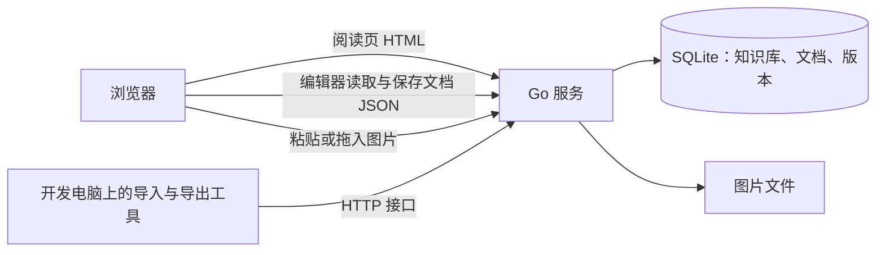

# Yuyan（语燕）设计讨论稿

更新日期：2026-09-26

状态：已部署到 ali 并正式导入全部笔记（阶段 C，见 11.2）；用户已在电脑和手机上确认可以正常使用。界面与编辑体验改版（阶段 D）的方案见第 12 节，尚未开始开发。

本文件是项目方案的统一讨论入口。后续讨论直接修改对应章节，保持“已确认需求”“建议实现”“待讨论事项”的区别：第 2 节为已确认需求；第 3–12 节为建议实现；第 13 节为待讨论事项。技术选型可以调整；不能把建议或验证计划写成已经实现的能力。

2026-09-26 项目方向调整：不再以 Obsidian 为出发点。此前“Obsidian 多仓库同步 + 图床 + 阅读站 + 配置中心”的方案已停止，讨论记录保存在 [archive/obsidian-sync-design.md](archive/obsidian-sync-design.md)，其中第 3 节的笔记库调查仍作为导入依据。

## 1. 项目定位与当前工作范围

Yuyan（语燕，名称模仿语雀）是一个供用户一人使用的网页知识库，部署在 ali 上：在浏览器中完成写作、编辑和阅读，功能取语雀网页版中适合单人使用的部分。

- 内容由 Yuyan 独立保存，不依赖 Obsidian。Obsidian 继续作为个人笔记工具，由用户自行维护（本地单个仓库，经 GitHub 同步）；两者之间只有导入和导出关系。
- 现有 `Crashmere/ObsidianRepository` 继续作为用户的笔记同步仓库，此前“改名归档”的计划取消。
- 命名：代码仓库为公开的 `Crashmere/Yuyan`，本地目录为 `~/ali/Yuyan`；服务器上的目录、URL 前缀、运行用户和 systemd unit 使用 `yuyan`。
- 2026-09-26 已部署到 ali，经共享 Nginx 以 `/yuyan/` 访问，全部笔记已正式导入。

## 2. 已确认需求

| 方面 | 要求 |
| --- | --- |
| 定位 | 单人使用的网页知识库：一个人写作、编辑和阅读；功能只取语雀网页版中适合单人使用的部分 |
| 与 Obsidian 的关系 | 各自独立：Yuyan 自己保存内容，内容可随时导出为 Markdown |
| 协作与分享 | 不需要：没有分享、协作和评论，也没有公开与私密之分 |
| 编辑体验 | 所见即所得，参照语雀；可以直接用 Markdown 语法快速输入格式，例如 `#` 标题、`-` 无序列表、三个反引号代码块 |
| 编辑器选型原则 | 扩展性和可定制性优先，尽量通过自研扩展实现所需功能 |
| 知识库划分 | 原来的顶层目录各为一个知识库；`备份` 只是当时的临时堆放目录，其下的子目录各自提升为顶层知识库，`备份` 本身不保留 |
| 现有笔记 | 全部导入，只导入一次；导入后这些笔记以 Yuyan 为准，只在 Yuyan 中修改，Obsidian 中的旧副本不再同步 |
| Markdown 能力 | 代码高亮、数学公式、表格、图片、Callout 与折叠、Mermaid、目录 |
| 图片 | 全部保存在服务器本地 |
| 样式偏好 | 尽量通过 CSS 满足样式需求 |
| 访问与安全 | 本期使用 HTTP 直接访问，不做登录，也不做 SSH 隧道；HTTPS 与登录由用户以后独立完成，与 ali 上其他应用一起迁移 |
| 手机 | 手机上只需要阅读，编辑在电脑上进行 |
| 代码仓库 | `Crashmere/Yuyan` 公开；不提交真实笔记、数据库、备份和服务器公网地址，测试使用合成样例 |
| 异机备份 | 暂时不做 |
| 发布 | 推送 main 后自动发布；测试不通过则不发布 |
| 服务器 | 使用现有 SSH 别名 `ali` 对应的服务器，遵守共享 `server-operations` 约定 |
| 开发方式 | 接受必要的开发成本，先通过文档明确方案 |
| 界面改版（2026-09-26） | 参照语雀改版界面与编辑体验；页面改为单页应用，切换文档、进入和退出编辑都不整页刷新；依次改进整体观感、目录管理、编辑器操作和内容块，搜索面板与知识管理功能放到以后 |
| 格式范围 | 本轮只在 Markdown 能表达的范围内优化；文字颜色、对齐、图片说明、合并单元格、分栏、附件、画板等超出 Markdown 的格式留作以后扩展 |
| 同名分组与文档 | 导入产生的 7 处“同名分组 + 同名文档”合并为带子文档的文档；目录能够移动后由 agent 通过接口处理，操作前先备份 |

安全暂不处理是用户确认的选择：在 HTTPS 与登录完成之前，任何知道地址的人都可以查看、编辑和删除内容。版本历史、回收站和备份（见 3.3 与第 9 节）本身就是功能，也能在误操作或内容被改动时恢复。此前已确认笔记可以公开，含疑似密码写法的笔记由用户在导入前自行检查。

暂不做异机备份同样是用户确认的选择：导入后，新写的内容只存在于 ali，而本机备份与数据在同一块磁盘上，磁盘或云主机出问题时无法恢复。需要时可以手动导出一份 Markdown 到本地；导出功能目前尚未实现，在阶段 D 中最先补上（见 12.5）。

## 3. 建议架构

一个 Go 服务：SQLite 保存知识库、文档、版本和元数据，本地文件保存图片；前端在 CI 中构建并嵌入程序。ali 上不需要 Node、Docker 或数据库服务，与其他应用的运行方式一致。



### 3.1 页面与接口

- 所有页面和接口经共享 Nginx 以 `/yuyan/` 对外，服务只监听 `127.0.0.1:<端口>`。
- 阅读页由服务端渲染，打开快、适合手机；点击“编辑”进入编辑页，此时才加载编辑器。这与语雀的阅读和编辑分离相同，也避免阅读时下载编辑器脚本（ali 下行只有约 0.5 MB/s）。
- 所有写操作集中在 `/yuyan/api/` 下，经过同一个中间件入口。以后加登录时只需在这里接入，不需要调整页面或接口结构。
- 阶段 D 将改为单页应用（见 12.3）：页面地址和写接口入口不变，阅读正文仍由 Go 渲染，编辑器仍按需加载。

### 3.2 组件

| 组件 | 建议 | 说明 |
| --- | --- | --- |
| 后端 | Go + SQLite | 单个可执行文件，CI 构建 |
| 编辑器 | Tiptap 3 | 见第 5 节 |
| 存储格式 | Tiptap（ProseMirror）文档 JSON | 见 3.4 |
| 阅读页渲染 | Go 按文档 JSON 渲染 HTML | 与编辑器输出保持一致，见 6.3 |
| 导入与导出工具 | TypeScript，在开发电脑上运行 | 与编辑器共用同一套扩展定义和 Markdown 转换规则，见 4.3 与第 9 节 |
| 图片 | 按内容寻址的本地文件 | 见第 7 节 |
| 搜索 | 服务端全文匹配 | 从文档 JSON 提取纯文本；正文只有几 MiB，内存匹配即可，中文无需分词 |

### 3.3 内容组织

- 知识库：名称、简介和排序（排序尚未实现，见 12.5）。
- 文档树：文档可以嵌套、拖动排序和移动；导入时的目录成为只有标题的分组节点。拖动排序和移动尚未实现，见 12.5。
- 首页：知识库列表和最近编辑的文档。
- 保存即生效：编辑时自动保存，阅读页总是显示最新内容，不区分草稿和发布。
- 保存冲突：每次保存都携带文档的版本号。同一文档在两个标签页或两台电脑上同时编辑时，后保存的一方会收到提示，由用户选择重新加载或保留自己的版本，不会静默覆盖。
- 断网与保存失败：未保存的内容先保存在浏览器本地并自动重试；有未保存的内容时，关闭页面会提醒。
- 版本历史：编辑过程中定时生成快照，每次编辑会话结束时也生成一次；可以预览并恢复任一版本。文档 JSON 很小，首版全部保留。
- 回收站：删除的文档和知识库先进入回收站，可以恢复；回收站不自动清空，彻底删除需要手动确认（彻底删除尚未实现，见 12.5）。

### 3.4 存储格式

正文以 Tiptap 的文档 JSON 保存，并记录格式版本号；Markdown 只用于导入和导出。

- 编辑器直接读写自己的原生格式，日常编辑不会因为重新生成 Markdown 而改写格式。
- 可以保存 Markdown 表达不了的内容，例如文字颜色、对齐、Callout 的自定义标题和折叠状态、图片尺寸与对齐；以后新增的块类型也不受 Markdown 语法限制。
- 代价：
  - 数据不如 Markdown 直观，因此格式要有文档说明，并保证随时可以导出为 Markdown。
  - 阅读页需要一个 Go 渲染器，与编辑器的扩展一一对应（见 6.3）。
  - 扩展变化时，需要按格式版本号迁移旧文档。
- 导出 Markdown 时，Markdown 能表达的内容（Callout、公式、Mermaid、表格、高亮等）按 Obsidian 可读的写法输出；表达不了的部分降级为纯文本或 HTML，并在导出报告中列出。

此前曾建议以 Markdown 为存储格式。用户确认“扩展性和可定制性优先”后改为此方案：Tiptap 的官方 Markdown 支持仍是早期版本，只用于一次性导入和导出时，问题可以在导入报告中逐项核对，不会影响日常编辑。

## 4. 现有笔记导入

### 4.1 知识库与规模

调查基于 GitHub `Crashmere/ObsidianRepository` 的 `main@388e3bd`（2026-09-26），详见归档文档第 3 节。导入只做一次，按导入时 GitHub 上的最新状态进行，不必等 Obsidian 合并整理；导入前重新调查一次。

| 知识库 | 笔记数 | 来源 |
| --- | --- | --- |
| 算法课 | 63 | 顶层目录 |
| 读书笔记 | 55 | 顶层目录 |
| 开发手册 | 42 | 顶层目录 |
| 杂项 | 34 | 顶层目录 |
| AI记录 | 14 | 顶层目录 |
| MySQL | 26 | `备份/MySQL` |
| CentOS | 18 | `备份/CentOS` |
| Linux服务搭建 | 18 | `备份/Linux服务搭建` |
| 设计模式 | 16 | `备份/设计模式` |
| JUC | 12 | `备份/JUC` |
| CS | 7 | `备份/CS` |
| Spring | 6 | `备份/Spring` |
| 实验记录 | 3 | `备份/实验记录` |

共 13 个知识库、314 篇笔记；`备份` 目录下没有直接存放的笔记。

- 正文合计约 3.25 MiB，最大的一篇约 553 KiB。
- 1,538 张图片，约 339 MiB：大小中位数约 92 KiB，61 张超过 2 MiB；另有 21 张与其他图片内容完全相同。
- 未发现外链图片和 YAML 属性。

### 4.2 语法与转换

| 内容 | 数量 | 转换为 |
| --- | --- | --- |
| 代码块 | 约 3,428 个 | 代码块节点，保留语言；无法识别的语言回退为纯文本 |
| Callout | 726 个，其中 567 个带折叠标记 | Callout 节点，保留类型、标题和默认折叠状态 |
| 自定义 `[!code]` Callout | 313 个 | 同上，样式参照算法课的 `custom-callouts.css` |
| 数学公式 | 约 79 篇文章 | 行内与块级公式节点，逐篇检查能否渲染 |
| 表格 | 约 177 处 | 表格节点 |
| Markdown 图片 | 1,524 处引用 | 图片上传到图床，图片节点引用图片 ID |
| 其他图片语法 | Wiki 图片嵌入，以及 3 个带高度的 `` | 图片节点，保留尺寸 |
| Wiki 笔记链接 | 11 处 | 指向对应文档的内部链接 |
| 高亮、任务列表、删除线 | 有使用 | 对应的标记与节点 |

### 4.3 导入工具与流程

- 导入工具用 TypeScript 编写，在开发电脑上运行，与编辑器共用同一套扩展定义和 Markdown 解析规则，保证导入结果与在编辑器里粘贴 Markdown 的效果一致。它通过 HTTP 接口上传图片和文档，ali 上不需要 Node。
- 文件名成为文档标题；原路径记录在元数据中，用于链接解析和导入报告。
- 图片按原仓库的规则定位原文件。`AI记录/Gradle 入门.md` 引用的 `img-001.png` 存在两张内容不同的同名文件，必须明确选择，不能随意挑一张。
- 链接无法解析或有歧义时列入导入报告；未带协议的外链（如 `www.rpmfind.net`）标记为待修正。
- 先在开发电脑上的本地实例试跑，生成报告并抽查，确认后再导入 ali 上的正式实例。试跑可以反复执行，不会产生重复文档或图片。
- 正式导入只做一次，之后这些笔记以 Yuyan 为准，不再从 Obsidian 重新导入。
- 需要人工选择的项（如同名不同图）写在 overrides 文件中，不入库。正式导入时只有一项：`{"images": {"AI记录/Gradle 入门.md|img-001.png": "AI记录/attachments/img-001.png"}}`；导入完成后，本地文件已按用户要求删除。
- 导入后运行 `npm --prefix web run roundtrip -- --server <实例地址>`，确认每篇文档都能被编辑器原样接受。

## 5. 编辑器

### 5.1 选择 Tiptap 3 的理由

按“扩展性和可定制性优先”的原则，建议使用 Tiptap 3：

- 只提供编辑器内核，界面完全自己实现；每个功能都是一个扩展，需要时可以直接使用底层的 ProseMirror。
- 生态最大，维护活跃，MIT 许可。拖动块（DragHandle）、折叠块（Details）、公式（Mathematics，基于 KaTeX）、目录（TableOfContents）、文件粘贴与拖入（FileHandler）、稳定块 ID（UniqueID）等原付费扩展，已于 2025 年改为 MIT 开源。付费部分只剩协作、AI、文档格式转换和云服务，Yuyan 都不需要。
- 原生格式是 JSON，与 3.4 的存储方案一致；官方提供 Markdown 转换，以及不依赖浏览器的静态渲染器，可用于导入导出工具和一致性测试。

曾比较的其他候选：

- **Milkdown Crepe：** 开箱体验最接近语雀，Markdown 保真度好；但界面预设较多，深度定制不如 Tiptap 灵活。
- **Vditor：** 功能齐全；但架构较老，扩展方式受限。
- **BlockNote：** 提供现成的 Notion 式界面；但定制空间更小。

### 5.2 功能与需要自研的扩展

现成扩展覆盖：标题、列表与任务列表、引用、表格、代码块（lowlight 高亮）、图片、链接、高亮、文字颜色、对齐、撤销与重做、占位提示、字数统计、拖动块、折叠块、公式、目录、文件粘贴与拖入。

需要自研：

- 斜杠菜单与浮动工具栏的界面，基于 Tiptap 的 Suggestion 与 BubbleMenu。
- Callout 节点：类型、标题、默认折叠状态；在编辑器中可以切换类型、展开和折叠。
- Mermaid 块：编辑源码，并实时预览。
- 图片上传：粘贴或拖入后上传并显示进度，失败时保留图片并可重试。
- 代码块的语言选择与复制按钮。
- Obsidian 写法的 Markdown 解析与输出规则（Callout、高亮、图片尺寸），供导入、导出和粘贴 Markdown 使用。

### 5.3 Markdown 快捷输入

在行首或文字后输入 Markdown 符号，编辑器立即转换为对应格式；转换后马上按退格键，可以恢复为刚输入的原文。

- Tiptap 现成的输入规则：
  - `#` 到 `######` 加空格：一到六级标题。
  - `-`、`*` 或 `+` 加空格：无序列表；`1.` 加空格：有序列表；`[ ]` 或 `[x]` 加空格：任务列表。
  - `>` 加空格：引用。
  - 三个反引号（可以紧跟语言名）加空格或回车：代码块。
  - `---`：分割线。
  - `**粗体**`、`*斜体*`、`` `行内代码` ``、`~~删除线~~`、`==高亮==`、``。
- 需要自研的输入规则：
  - `> [!note]` 等 Obsidian 写法：Callout。
  - 三个反引号加 `mermaid`：Mermaid 块。
  - `$…$` 与 `$$`：行内与块级公式，按 Obsidian 的习惯配置。
  - `[文字](链接)`：链接。
- 中文输入法下，这些符号常被输入成全角，例如反引号变成 `·`、`>` 变成 `》`、`$` 变成 `￥`。输入规则同时识别这些全角写法，不必切换到英文输入。
- 表格通过斜杠菜单插入；粘贴一段 Markdown 文本时自动转换为对应格式。
- 常用格式同时提供快捷键，例如 `Ctrl`/`Cmd` + `B` 加粗。

### 5.4 原型验证

用真实笔记验证：

- Callout、公式、代码和表格从 Markdown 导入后的显示效果，以及再导出为 Markdown 的结果。
- KaTeX 能否渲染现有公式。这些公式是按 Obsidian 使用的 MathJax 写的，KaTeX 不支持的写法需要列出并决定处理方式。
- 553 KiB 长文的加载与编辑性能。
- 中文输入法下不丢字、不跳光标，Markdown 快捷输入（含全角写法）正常转换。
- 粘贴与拖入图片上传。

## 6. 阅读体验

### 6.1 页面

- 首页、知识库页（文档树）、文章页（文章目录、上一篇与下一篇）、搜索页。
- 阅读页适配手机；编辑页面向电脑，不为手机单独适配编辑交互。深色模式可选。

### 6.2 渲染能力

- 代码高亮在服务端完成；宽代码块和宽表格可以横向滚动。
- Callout 显示类型和标题，保留默认折叠状态并可以展开折叠。
- 公式与 Mermaid 只在含有它们的页面加载；脚本随站点部署，不依赖外部 CDN。
- 标题锚点支持中文；图片懒加载；长文测试滚动、目录和高亮性能。
- 中文使用系统字体，不下发中文网页字体。
- 渲染器只输出已知的节点类型并对文本转义；遇到未知节点时显示占位提示，不会因为编辑器新增扩展而导致页面出错。
- HTTP 页面上浏览器不提供剪贴板接口，代码复制按钮需使用降级方式。

### 6.3 编辑与阅读的一致性

编辑器在浏览器中渲染，阅读页由 Go 渲染。两者的 HTML 结构和类名保持一致，共用一份样式。CI 中维护一组覆盖全部节点类型的样例文档，分别用 Tiptap 的静态渲染器和 Go 渲染器生成 HTML 并比较，任何一端的改动都能及时发现不一致。

## 7. 图片

- 以图片内容的 SHA-256 作为 ID（可截取前 128 位）：相同内容共用一个对象，同名的不同图片得到不同 ID；图片对象不可原位覆盖。
- 原图保留，不默认有损压缩，GIF 保留动画；网页展示用的 WebP 或限宽图可以以后按需增加。
- 图片经编辑器或导入工具上传，按文件内容校验类型并限制大小。
- 图片由程序返回，并设置一年的 `immutable` 缓存。数据目录保持 0700，不让 Nginx 直接读取。ali 下行带宽实测只有约 0.5 MB/s（约 4 Mbps），长期缓存是必需的。
- 文档中只保存图片 ID，不保存带主机或前缀的地址；页面地址由渲染器和编辑器生成，导出时改写为相对路径并附带图片文件。
- 首版不自动删除图片。以后清理时需要同时考虑当前文档、版本历史和回收站中的引用。

## 8. 部署与运行

沿用共享 `server-operations` 约定：应用独立运行身份、只监听 loopback、systemd 管理、Nginx 路径入口，程序在 CI 构建。部署前重新核对共享应用清单和端口，登记新应用并验证已有应用。

- 应用自己的 Nginx location：
  - 按图片大小上限设置 `client_max_body_size`（Nginx 默认只有 1 MB）。
  - 为 CSS、JS、JSON 开启 gzip（ali 的 `nginx.conf` 目前只压缩 HTML）。
- 为服务设置内存和 CPU 上限；ali 只有约 1.7 GiB 内存，且没有 swap。
- 不引入新的系统运行依赖。
- CI/CD 沿用其他应用的做法：GitHub 托管 runner 构建前端和 Go 程序；独立的 `yuyan-deploy` 发布身份，配合 root 管理的发布脚本；发布前备份、健康检查和失败回退。推送 main 后自动测试并发布，测试不通过则不发布；纯文档提交加 `[skip ci]`。
- Yuyan 的程序内嵌编辑器、公式和 Mermaid 脚本，体积会比现有应用大不少，而 CI 跨境上传曾出现超时（见共享 `common-issues`）。因此 Yuyan 的发布脚本从一开始就先压缩再上传，并放宽上传时限。这只涉及 Yuyan 自己的脚本，不改动其他应用。

建议的服务器数据结构，此结构是设计提案，不是现场目录清单：

```text
/opt/yuyan/
  config/          运行与部署配置
  data/
    yuyan.db       SQLite：知识库、文档、版本、图片元数据
    assets/        图片原图
  backups/         一致性备份
  releases/        程序发布结果
  docs/            已发布项目文档副本
```

## 9. 备份、导出与恢复

- 每日备份：SQLite 一致性快照，加上图片硬链接和校验清单，做法参照 FabricWorld 与 RecipeBox。备份 unit 的可写路径必须覆盖整个应用目录，否则硬链接会失败，见共享 `common-issues`。启用 timer 后，通过 unit 实际运行一次备份并确认成功。
- 暂时不做异机备份（见第 2 节），与 ali 上其他应用一样只有同盘备份。以后需要时，图片是不可变文件，可以增量同步到别处。
- 导出：在网页中导出单篇或单个知识库，用导出工具导出全部内容；格式为 Markdown 加图片（相对路径），可以直接用 Obsidian 打开。目前只有 Markdown 转换函数与测试，网页导出和导出工具都尚未实现，见 12.5。
- 在隔离端口上演练恢复，不使用生产数据库做测试。

## 10. 安全与 HTTPS（由用户以后独立完成）

本期按 HTTP 直接访问，不做登录（见第 2 节）。为以后接入登录和 HTTPS 保留的结构：

- 所有写接口集中在 `/yuyan/api/` 下，经过同一个中间件入口。
- 需要判断协议时按 Nginx 传来的 `X-Forwarded-Proto`，不使用 `r.TLS`。
- 页面和文档中不出现带协议和主机的本站地址。
- 启用 HTTPS 后，Cookie 设置 Secure。

### 全服务迁移 HTTPS 的评估（2026-09-26，供用户独立实施时参考）

使用 Let's Encrypt 的 IP 地址证书，不需要域名。

- **证书工具：** Ubuntu 26.04 仓库中的 certbot 为 4.0、lego 为 4.9，都不支持签发 IP 证书（certbot 需要 5.4 以上）。需要从 snap 安装新版 certbot，或使用 lego 官方发布的程序。
- **共享 Nginx：** 80 端口增加证书验证路径；新增 443 监听，同时开启 HTTP/2。HTTP 保留可用，不强制跳转、不启用 HSTS，续期失败时仍有后备。
- **现有四个应用都要改代码：** 它们的写入来源校验用 `r.TLS` 判断协议。TLS 在 Nginx 终止后，应用看到的永远是 HTTP，而浏览器经 HTTPS 访问时发送 `Origin: https://…`，所有写操作都会返回 403。每个应用要改为信任 Nginx 传来的 `X-Forwarded-Proto`，并在各自的 Nginx location 中设置该头；四个仓库分别测试和发布。
- **续期：** IP 证书有效期约 6 天，必须全自动续期，续期后重载 Nginx；通过 systemd timer 实际运行一次续期并确认成功。
- **文档：** 共享约定、服务器清单、重建步骤和四个项目的文档都要更新。
- **云安全组：** 从开发用的 Mac 测试 443 端口得到“连接被拒绝”而不是超时，说明安全组很可能已放行，只是没有程序监听；启用后需再确认。
- **长期维护：** 正常情况下全自动。主要风险是续期失败时留给人工处理的时间只有几天，而服务器目前没有告警，建议把证书到期检查加入 `inspect.sh`。服务器公网 IP 变化时需要重新签发。

## 11. 实施阶段与验收

### 阶段 A：设计讨论（已完成）

- 维护本文，确定首版范围和主要选型。

### 阶段 B：原型（已完成，结果见 11.1）

- 新建 `Crashmere/Yuyan` 仓库，本地目录改名为 `~/ali/Yuyan`。
- 原型和导入试跑都在开发电脑上运行，不在 ali 上另开测试实例。
- 编辑器：搭建 Tiptap 编辑器与 Callout、Mermaid、图片上传、Markdown 快捷输入等自研扩展，按 5.4 用真实笔记验证。
- 导入工具：在副本上完整试跑，查看导入报告。
- 阅读页：实现 Go 渲染器与一致性测试，用代表样本验证，包括 `题目描述.md`、树形 DP、最短路、《Effective C++》、最长的一篇，以及新写的 Mermaid 样本。

### 11.1 阶段 B 结果（2026-09-26）

- **已实现：** Go 存储层、HTTP 接口与服务端渲染页面；Tiptap 编辑器（斜杠菜单、浮动工具栏、拖动块、Callout、Mermaid 预览、图片上传、含全角写法的 Markdown 快捷输入、自动保存、冲突检测、断网暂存）；导入工具；原样保存检查工具；编辑与阅读的一致性测试；CI（目前只做检查，发布作业随首次安装加入）。
- **导入试跑：** 在开发电脑的本地实例上，按 GitHub 当前状态导入 13 个知识库、53 个分组、314 篇文档、1,528 张图片，用时约 12 秒。服务端按内容去重后存 1,511 个图片文件，数据目录约 357 MB。导入报告中需要处理的项全部为 0。
- **导入中处理的问题：**
  - `AI记录/Gradle 入门.md` 引用的 `img-001.png` 有两张同名图片。笔记描述的是 IDEA 项目截图，因此选 `AI记录/attachments/img-001.png`（该仓库在 Obsidian 中的附件目录也是 `./attachments`），另一张是 Windows 磁盘列表。
  - `备份/CentOS/软件安装.md` 中未写协议的链接 `www.rpmfind.net` 按 `https://www.rpmfind.net` 导入。
  - KaTeX 原有 10 处无法渲染，主要是写在行内公式里的 `align` 等环境（MathJax 能显示）。改为按块级公式渲染，并忽略只影响细节的严格模式提示后，降为 0。
  - 转换器原先会给嵌套的同类格式重复加标记，行内代码也不能与粗体、链接并存（Tiptap 默认规则），共有 10 篇文档含编辑器不接受的格式组合。现在同类标记只保留一个，schema 允许行内代码与其他格式并存。
  - 以代码块等结尾的 162 篇文档，导入时在末尾补一个空段落，避免只是打开编辑页就触发一次自动保存。
- **原样保存检查：** 314 篇文档全部被编辑器 schema 原样接受。
- **浏览器验证：** Markdown 快捷输入（含全角写法）、Callout 标题回车、任务列表、自动保存与刷新后内容保留、Mermaid 渲染；阅读页的 Callout 折叠、`align` 公式、三张并排的 `height=150` 图片、11 处内部链接。
- **发现并修复：** Go 的 embed 默认忽略以 `_` 开头的文件，Vite 生成的 `_baseUniq-*.js` 被漏掉，导致 Mermaid 加载失败，已改用 `all:` 前缀。
- **性能（开发电脑）：**
  - 最长的“重装系统”约 3,800 个块、187 个代码块：阅读页服务端渲染约 16 毫秒，HTML 970 KB，gzip 后约 300 KB；编辑器用整篇内容重新渲染约 174 毫秒，打字每个字符约 13 毫秒（含布局）。
  - 阅读页脚本约 9 KB；编辑器脚本约 1.2 MB（未压缩），只在编辑页加载。Linux 程序约 25 MB。
  - 按 ali 约 0.5 MB/s 的下行速度，部署时 Nginx 必须压缩 HTML、JSON、JS 和 CSS（见第 8 节）。
- **用户试用（2026-09-26）：** 在本地试跑实例上实际输入、粘贴大段 Markdown、粘贴图片，均按预期工作。
- **部署后验证：** 手机上的阅读排版已在阶段 C 确认（见 11.2）。

### 阶段 C：首版（已完成部署与正式导入，结果见 11.2）

- 在 ali 安装与部署：运行身份、目录、systemd、Nginx location（含压缩与图片缓存）、发布脚本（压缩上传）、CI 发布作业、备份与隔离恢复验证。
- 在 ali 的空实例上正式导入全部笔记，使用与试跑相同的 overrides 文件，并运行原样保存检查。
- 用户试用后，按反馈补齐首版功能细节。

### 11.2 阶段 C 结果（2026-09-26）

- **安装：** `/opt/yuyan`，服务监听 127.0.0.1:18084，经共享 Nginx `/yuyan/` 访问；运行身份 yuyan，发布身份 yuyan-deploy（只能执行发布命令，sudo 只允许 root 管理的发布脚本）。GitHub production 环境保存四个发布凭据，主机公钥与本机记录的指纹一致。操作细节见 [OPERATIONS.md](OPERATIONS.md)。
- **自动发布：** 推送 main 后 CI 测试并发布；首次自动发布 `0456e29` 成功，测试约 34 秒，压缩上传与发布约 13 秒。
- **正式导入：** 按 GitHub `388e3bd` 导入 13 个知识库、53 个分组、314 篇文档、1,528 张图片（去重后 1,511 个文件），用时约 7.4 分钟；报告中需要处理的项全部为 0；原样保存检查 314 篇全部通过。
- **访问：** 最长的文档页面经 gzip 压缩后约 310 KB，从开发电脑打开约 0.6 秒；图片带一年的 `immutable` 缓存。
- **备份：** 通过 unit 备份成功（数据库加 1,511 张图片，图片为硬链接）；在 19084 完成隔离恢复演练，恢复后的知识库、文档、图片数量与正式实例一致。
- **资源：** 程序本身约 30 MiB；`MemoryCurrent` 另含导入写入图片留下的约 320 MiB 文件缓存，可随时回收，没有发生 OOM。
- **用户确认：** 手机上可以正常显示和使用。
- **本地数据：** 试跑实例、笔记副本和导入报告已按用户要求从开发电脑删除。

### 阶段 D：界面与编辑体验改版（方案见第 12 节，尚未开始）

- 先做导出工具，再依次完成 D1 框架、目录与导出，D2 编辑器交互，D3 内容块；每步单独发布，由用户验证后进入下一步。

### 阶段 E：后续按需

- 快捷键搜索面板与关键词高亮；标签、收藏、文档模板、文档间链接选择器（`[[`）与反向链接、历史版本差异对比、附件（PDF 等）上传、自定义 CSS。
- 超出 Markdown 的格式扩展（见 12.1）。
- 用户独立完成全服务 HTTPS 迁移和登录后，在 3.1 预留的入口接入。

### 首版验收条件

1. 能完成新建、编辑、自动保存、恢复历史版本、从回收站恢复；中文输入流畅，Markdown 快捷输入可用；粘贴或拖入的图片能上传。
2. 13 个知识库、314 篇笔记全部导入；导入报告中的歧义与断链均已处理或明确记录；抽查样本在阅读页和编辑器中显示正确；导出 Markdown 后，Callout、公式、代码和表格仍然正确。
3. 阅读页支持代码高亮、公式、Mermaid、Callout 折叠、表格和文章目录，手机上可以正常阅读；编辑与阅读的一致性测试通过。
4. 图片保存在服务器本地并按内容去重，阅读时长期缓存生效。
5. 备份包含 SQLite 与图片，并完成隔离恢复验证；可以导出全部内容。
6. 同一文档在两处同时编辑不会静默覆盖；断网时未保存的内容不丢失。
7. 新服务不改变其他 ali 应用的访问与运行行为。

2026-09-26 核对：第 5 条中的“可以导出全部内容”尚未实现，第 2 条的导出结果目前只由 Markdown 转换函数的测试覆盖（见 12.2）；导出在阶段 D 中最先补上。

## 12. 界面与编辑体验改版（阶段 D）

2026-09-26 用户提出：现有界面过于简陋，编辑功能与语雀差距很大，开始规划改版。本节是按用户确认的范围写的建议实现，尚未开始开发。

### 12.1 范围

- 参照语雀网页版的界面与交互，视觉贴近语雀：绿色主色、浅灰侧栏、线性图标、紧凑的界面文字。
- 按用户确认的优先级依次改进整体观感、目录管理、编辑器操作和内容块。快捷键搜索面板与知识管理功能（文档互链与反向链接、历史版本对比、模板、标签、收藏）放到阶段 E。
- 本轮只在 Markdown 能表达的范围内优化，不扩展文档格式。现有节点已经能支撑本节全部功能：标题、列表与任务列表、引用、代码块与 Mermaid、公式、表格与列对齐、图片与尺寸、Callout 与折叠、高亮，以及已有的下划线（导出为 `<u>`）。因此文档格式和一致性快照都不需要改。超出 Markdown 的格式（文字颜色、段落对齐、图片对齐与说明、合并单元格、列宽、单元格底色、没有表头的表格、分栏、附件、画板等）留作以后扩展。
- 代码行号、自动换行、页面宽度、主题等显示设置保存在浏览器本地，不写入文档。
- 手机仍只需阅读，编辑面向电脑。

### 12.2 现状问题

2026-09-26 检查代码和线上页面（只读）的结果：

- **基础组件：** 新建、重命名、删除、插入链接、编辑公式都用浏览器原生弹窗；界面上没有图标、下拉菜单、右键菜单和对话框。
- **目录：** 不能折叠（算法课的 75 个节点全部展开），没有悬停和右键操作，不能拖动排序或移动；服务端没有移动和排序接口，回收站没有彻底删除（均属 3.3 的内容，尚未实现）。
- **页面：** 阅读页和编辑页是两套布局，编辑时看不到目录；知识库页只是把侧栏目录再列一遍；手机上目录堆在正文上方，最多占 40% 屏高。
- **编辑器：** 没有顶部工具栏，选区工具栏只有 6 个按钮；块左侧只有拖动手柄；斜杠菜单是纯文字列表；链接和公式用浏览器弹窗编辑；表格插入后不能用界面增删行列；图片不能缩放，阅读页不能放大；代码块语言用原生下拉框选择；没有查找替换、编辑时的大纲和快捷键说明。
- **导出：** 第 9 节的网页导出和导出工具都没有实现，只有 Markdown 转换函数和测试，因此首版验收第 5 条中的“可以导出全部内容”并未达成。
- **数据：** 导入把 Obsidian 的 7 处文件夹笔记变成了并列的“同名分组 + 同名文档”，见 12.8。

### 12.3 页面架构：单页应用

用户确认改为单页应用：切换文档、进入和退出编辑都不整页刷新，编辑时侧栏和大纲常驻。

- 页面地址不变：`/`、`/books/{id}`、`/docs/{id}`、`/docs/{id}/edit`、`/docs/{id}/history`、`/versions/{id}`、`/search`、`/trash`。正文中的站内链接和已有书签继续有效，点击站内链接在应用内跳转。
- Go 对这些地址返回同一个页面外壳，并内嵌当前地址需要的初始数据，首屏不必再等一轮接口请求；ID 不存在时返回 404 状态码，由应用显示“找不到内容”。现有的 Go 页面模板和阅读页入口脚本随之删除。
- 正文仍由 Go 渲染器生成：新增接口返回渲染后的 HTML、文章目录和上下篇，沿用按修订号的缓存；公式、Mermaid、代码复制、Callout 折叠等增强沿用现有脚本。编辑器、KaTeX 和 Mermaid 仍按需加载，阅读时不下载编辑器。
- 离开编辑视图（点“完成”、切换文档、点目录）前先等待保存完成；离线、保存失败或冲突时给出提示，未保存的内容仍留在本地草稿中。保存后正文缓存失效，回到阅读视图即显示最新内容；标题修改同步到目录。
- 脚本预算：阅读时首次加载的应用脚本 gzip 后不超过约 120 KB，按内容哈希长期缓存；编辑器单独分块。每次发布前核对构建产物。
- 写接口仍集中在 `/api/` 的同一个中间件入口，不影响以后接入登录。

### 12.4 界面基础

- **设计规范：** 颜色、字号、间距、圆角、阴影用 CSS 变量定义，浅色和深色各一套；增加“跟随系统 / 浅色 / 深色”手动切换，Mermaid 主题随之切换。
- **组件：** 继续用 Vue 3，加上 Reka UI（不带样式、支持键盘操作与无障碍的菜单、对话框、弹出层、右键菜单、提示等组件，MIT）和 Lucide 图标（ISC，只打包用到的图标），样式自己写。Tiptap 官方的界面组件只有 React 版，只作交互参考。
- 所有浏览器原生弹窗（prompt、confirm、alert）改为应用内的对话框、浮层和轻提示。
- 先在本机做可点击的原型（合成数据），覆盖首页、知识库首页、阅读页、编辑页框架和目录操作；用户确认视觉与交互后再全面实现。

### 12.5 框架、目录与导出（D1）

- **顶栏：** 面包屑（知识库 / 上级文档 / 当前文档）、搜索入口、新建、主题切换。
- **侧栏：** 分工作台（首页、知识库列表、回收站）和知识库（名称与目录）两种；可拖动调宽、可收起，状态保存在本地。
- **目录树：**
  - 折叠与展开，按知识库记住展开状态；打开文档时自动展开到当前文档并滚动到可见处。
  - 文档和分组使用不同图标；悬停显示“+”（新建子文档）和“…”；“…”与右键菜单提供新建子文档、新建分组、重命名（原地编辑）、移动到、复制链接、导出、删除。
  - 可以拖到节点之前、之后或里面，并显示落点提示；不能拖进自己的子孙节点。“移动到”对话框可以选择其他知识库，子文档随之移动。
  - 服务端新增移动接口：在同一事务内重排同级顺序，并校验不会成环；在目录中重命名同样检查修订号，与打开的编辑页冲突时给出提示。
- **知识库：** 知识库首页显示名称、简介（可编辑）、文档数、最近更新和完整目录；首页的知识库卡片可以拖动排序。
- **首页：** 最近浏览（本机记录）、最近编辑、知识库卡片和新建入口。
- **回收站：** 恢复、彻底删除（二次确认）和清空回收站；图片文件不随之删除，与第 7 节一致。
- **搜索：** 沿用现有搜索，迁移为应用内页面。
- **导出：** 补上第 9 节的导出。网页中可以导出单篇（Markdown）和整个知识库（Markdown 加图片的压缩包，按目录结构存放，图片使用相对路径）；另提供在开发电脑上导出全部内容的工具。全部图片约 340 MB，按 ali 约 0.5 MB/s 的下行速度约需 12 分钟。导出工具不依赖新界面，最先做。
- **手机：** 目录和大纲改为抽屉，正文全宽。

### 12.6 编辑器交互（D2）

- **布局：** 编辑视图与阅读视图共用框架，侧栏常驻，右侧大纲可以开关，正文上方是固定工具栏；可切换专注模式隐藏侧栏。
- **顶部工具栏：** 撤销、重做；正文与标题 1–6；粗体、斜体、删除线、下划线、行内代码、高亮；链接；无序、有序和任务列表；插入菜单（引用、Callout、代码块、Mermaid、公式、表格、图片、分割线）；清除格式。右侧是查找替换、大纲开关和更多（快捷键说明、页面宽度）。
- **选区工具栏：** 常用格式、链接、转为标题或正文、清除格式。
- **块手柄：** 鼠标移到块左侧时显示“+”（在下方插入）和拖动手柄；点击手柄打开块菜单：转换为其他块类型、复制、删除、上移、下移。
- **斜杠菜单：** 图标、分组、说明和对应的 Markdown 写法；保留拼音首字母匹配；最近使用的项目置顶；插入表格时用网格选择行列数。
- **链接：** `Cmd/Ctrl + K` 或工具栏打开链接浮层；光标位于链接上时显示链接卡片（打开、编辑、取消链接）。
- **公式：** 点击公式或用快捷输入插入后打开浮层，输入 LaTeX 并实时预览，Enter 确认，Esc 取消。
- **其他：** 编辑时的大纲随滚动高亮、点击跳转；`Cmd/Ctrl + F` 查找替换（可区分大小写、全部替换）；`Cmd/Ctrl + /` 打开快捷键说明，常用快捷键与语雀一致。
- 保存状态改为图标加文字；自动保存、冲突检测和本地草稿的机制不变。

### 12.7 内容块（D3）

- **表格：** 选中单元格时显示表格工具：在上下左右插入行列、删除行列或整个表格、整列左中右对齐（对应 Markdown 的列对齐）。
- **图片：** 选中后显示工具条：适应宽度、原始尺寸、常用宽度、替换、下载、查看原图、编辑替代文字、删除；拖动角点调整宽度，写入已有的宽度属性，导出为 Obsidian 的 `|宽度` 写法。上传时先显示占位和进度，失败可以重试。阅读页点击图片放大查看，可以在同一页的图片之间切换。
- **代码块：** 可搜索的语言选择、复制、Tab 与 Shift+Tab 缩进；行号和自动换行作为显示设置；阅读页的长代码可以折叠。
- **Callout：** 带颜色和图标的类型选择面板、折叠方式切换；编辑器中标题为空时显示与阅读页相同的默认标题。
- **Mermaid：** 源码与预览并排；语法有误时给出提示，并保留上一次成功的预览。

### 12.8 同名分组与文档的合并

用户确认合并。D1 的移动功能上线后，通过接口处理下列 7 处：把分组下的文档移到同名文档下面，再删除已空的分组（进入回收站，可以恢复）。只调整目录结构，不改文档内容；操作前先备份，完成后核对目录并请用户确认。

- 设计模式：创建型模式（分组下 5 篇）、结构型模式（4 篇）、行为型模式（4 篇）。
- Spring：组件注册（2 篇）。
- 开发手册 / 文件处理：操作本地文件、获取文件信息、文件加工（各 1 篇）。

### 12.9 实施与验收

- **顺序：** 导出工具 → D1 框架、目录与导出 → D2 编辑器交互 → D3 内容块。每步单独推送 main 自动发布，用户在电脑和手机上验证后再进入下一步；D1 先交付本地原型。
- **测试：**
  - 现有的 Go 与前端单元测试、一致性测试继续运行；新增移动、彻底删除和页面外壳的 Go 测试。
  - CI 增加浏览器端到端冒烟测试（Playwright + Chromium，对使用合成数据的临时实例）：打开首页、进入文档、编辑并自动保存、在目录中拖动移动、从回收站恢复；不通过则不发布。
  - D2、D3 改动编辑器配置，发布前用新编辑器对线上全部文档运行原样保存检查（只读）。
- **验收：**
  1. D1：现有功能（新建、编辑、自动保存、冲突提示、历史与恢复、回收站、搜索）在新界面全部可用，不再出现浏览器原生弹窗；目录的拖动与移动正确，刷新后保持；能导出单篇、单个知识库和全部内容，导出结果能用 Obsidian 打开；手机阅读正常；阅读脚本符合 12.3 的预算。
  2. D2：12.6 的交互可用；中文输入法下工具栏、斜杠菜单和 Markdown 快捷输入正常；最长的文档（约 3,800 个块）编辑不卡顿。
  3. D3：12.7 的操作可用；导出 Markdown 后，表格、图片尺寸、代码块和 Callout 保持正确。

## 13. 待讨论事项

- D1 原型确认后再定的细节：侧栏默认宽度、界面字号、正文宽度等。
- 阶段 E 的范围与先后：快捷键搜索面板、知识管理功能、超出 Markdown 的格式、附件、自定义 CSS。

## 14. 参考来源

- [此前的 Obsidian 方案与笔记库调查](archive/obsidian-sync-design.md)。
- [Tiptap 文档](https://tiptap.dev/docs)、[原付费扩展改为 MIT 开源的说明](https://tiptap.dev/blog/release-notes/were-open-sourcing-more-of-tiptap)、[Tiptap 3 发布说明](https://tiptap.dev/blog/release-notes/tiptap-3-0-is-stable)、[Tiptap Markdown](https://tiptap.dev/docs/editor/markdown)。
- 曾比较的编辑器：[Milkdown](https://github.com/Milkdown/milkdown)、[Vditor](https://github.com/Vanessa219/vditor)、[BlockNote](https://github.com/TypeCellOS/BlockNote)。
- 阶段 D 的界面组件：[Reka UI](https://reka-ui.com)、[Lucide 图标](https://lucide.dev)；交互参考 [Tiptap UI Components](https://tiptap.dev/docs/ui-components/getting-started/overview)（React 版）；端到端测试 [Playwright](https://playwright.dev)。
- [Let's Encrypt：6 天与 IP 地址证书正式可用](https://letsencrypt.org/2026/01/15/6day-and-ip-general-availability.html)。
- [服务器维护约定的来源](https://github.com/Crashmere/agent-config/tree/main/skills/server-operations)。

外部项目的能力与接口可能变化，实施时固定版本并用实际文档验证。服务器实况以部署时的现场检查为准，本文不替代共享服务器清单或项目运维记录。
