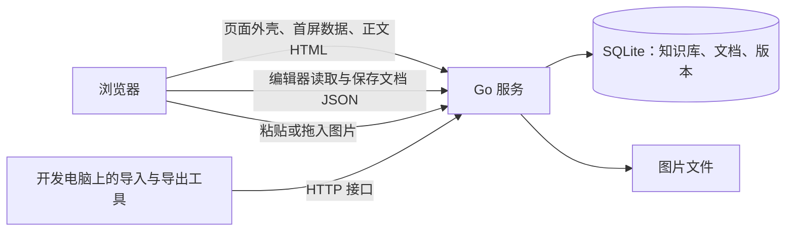

# Yuyan（语燕）设计讨论稿

更新日期：2026-09-27

状态：已部署到 ali 并正式导入全部笔记（阶段 C，见 11.2）；用户已在电脑和手机上确认可以正常使用。界面与编辑体验改版（阶段 D，第 12 节）中，D1（单页应用、新界面、目录管理与导出）已经用户确认发布，结果见 12.10；D2 编辑器交互与 D3 内容块已完成并发布，结果见 12.11、12.12，用户已验收。阶段 E 第一批（搜索面板、版本对比、图片预留尺寸、固定 CI 运行环境）已发布，结果见 13.6，2026-09-27 用户验收完毕。第二批小功能（搜索知识库与全拼、从搜索结果定位、大纲隐藏、菜单滚动提示）已发布，见第 14 节。第三批（手机端大纲与代码复制按钮的修复、离开文档时停止加载图片、Obsidian 代码框风格、正文按标题折叠、大纲移到右侧）已发布，见第 15 节。第四批（语雀式代码块，线上 `[!code]` 全部改回代码块）已发布并完成线上迁移，见第 16 节。第五批（大纲按语雀方式收起）见第 17 节。第六批（统一按钮提示、大纲与目录折叠、取消编辑、表格拖动调整宽高等十项）见第 18 节。

本文件是项目方案的统一讨论入口。后续讨论直接修改对应章节，保持“已确认需求”“建议实现”“待讨论事项”的区别：第 2 节为已确认需求；第 3–18 节为建议实现；第 19 节为待讨论事项。技术选型可以调整；不能把建议或验证计划写成已经实现的能力。

2026-09-26 项目方向调整：不再以 Obsidian 为出发点。此前“Obsidian 多仓库同步 + 图床 + 阅读站 + 配置中心”的方案已停止，讨论记录保存在 [archive/obsidian-sync-design.md](archive/obsidian-sync-design.md)，其中第 3 节的笔记库调查仍作为导入依据。

## 1. 项目定位与当前工作范围

Yuyan（语燕，名称模仿语雀）是一个供用户一人使用的网页知识库，部署在 ali 上：在浏览器中完成写作、编辑和阅读，功能取语雀网页版中适合单人使用的部分。

- 内容由 Yuyan 独立保存，不依赖 Obsidian。Obsidian 继续作为个人笔记工具，由用户自行维护（本地单个仓库，经 GitHub 同步）；两者之间只有导入和导出关系。
- 现有 `Crashmere/ObsidianRepository` 继续作为用户的笔记同步仓库，此前“改名归档”的计划取消。
- 命名：代码仓库为公开的 `Crashmere/Yuyan`，本地目录为 `~/ali/Yuyan`；服务器上的目录、URL 前缀、运行用户和 systemd unit 使用 `yuyan`。
- 2026-09-26 已部署到 ali，经共享 Nginx 以 `/yuyan/` 访问，全部笔记已正式导入。

## 2. 已确认需求

| 方面 | 要求 |
| --- | --- |
| 定位 | 单人使用的网页知识库：一个人写作、编辑和阅读；功能只取语雀网页版中适合单人使用的部分 |
| 与 Obsidian 的关系 | 各自独立：Yuyan 自己保存内容，内容可随时导出为 Markdown |
| 协作与分享 | 不需要：没有分享、协作和评论，也没有公开与私密之分 |
| 编辑体验 | 所见即所得，参照语雀；可以直接用 Markdown 语法快速输入格式，例如 `#` 标题、`-` 无序列表、三个反引号代码块 |
| 编辑器选型原则 | 扩展性和可定制性优先，尽量通过自研扩展实现所需功能 |
| 知识库划分 | 原来的顶层目录各为一个知识库；`备份` 只是当时的临时堆放目录，其下的子目录各自提升为顶层知识库，`备份` 本身不保留 |
| 现有笔记 | 全部导入，只导入一次；导入后这些笔记以 Yuyan 为准，只在 Yuyan 中修改，Obsidian 中的旧副本不再同步 |
| Markdown 能力 | 代码高亮、数学公式、表格、图片、Callout 与折叠、Mermaid、目录 |
| 图片 | 全部保存在服务器本地 |
| 样式偏好 | 尽量通过 CSS 满足样式需求 |
| 访问与安全 | 公网使用可信 IP 证书的 HTTPS，与 ali 上其他应用共享 Nginx；HTTP 跳转 HTTPS，登录认证待后续接入 |
| 手机 | 手机上只需要阅读，编辑在电脑上进行 |
| 代码仓库 | `Crashmere/Yuyan` 公开；不提交真实笔记、数据库、备份和服务器公网地址，测试使用合成样例 |
| 异机备份 | 暂时不做 |
| 发布 | 推送 main 后自动发布；测试不通过则不发布 |
| 服务器 | 使用现有 SSH 别名 `ali` 对应的服务器，遵守共享 `server-operations` 约定 |
| 开发方式 | 接受必要的开发成本，先通过文档明确方案 |
| 界面改版（2026-09-26） | 参照语雀改版界面与编辑体验；页面改为单页应用，切换文档、进入和退出编辑都不整页刷新；依次改进整体观感、目录管理、编辑器操作和内容块，搜索面板与知识管理功能放到以后 |
| 格式范围 | 以 Markdown 可表达的格式为基础；按用户要求支持表格尺寸及图片、段落、表格对齐，导出为 HTML 保留。文字颜色、图片说明、合并单元格、分栏、附件、画板等留作以后扩展 |
| 同名分组与文档 | 导入产生的 7 处“同名分组 + 同名文档”合并为带子文档的文档；目录能够移动后由 agent 通过接口处理，操作前先备份 |

公网已接入 ServerPortal 统一设备认证；授权设备可以查看、编辑和删除内容。版本历史、回收站和备份（见 3.3 与第 9 节）本身就是功能，也能在误操作或内容被改动时恢复。含敏感信息的笔记仍由用户在导入前自行检查。

暂不做异机备份同样是用户确认的选择：导入后，新写的内容只存在于 ali，而本机备份与数据在同一块磁盘上，磁盘或云主机出问题时无法恢复。需要时可以用导出工具在本地导出一份 Markdown 和图片（见 OPERATIONS.md）。

## 3. 建议架构

一个 Go 服务：SQLite 保存知识库、文档、版本和元数据，本地文件保存图片；前端在 CI 中构建并嵌入程序。ali 上不需要 Node、Docker 或数据库服务，与其他应用的运行方式一致。



### 3.1 页面与接口

- 所有页面和接口经共享 Nginx 以 `/yuyan/` 对外，服务只监听 `127.0.0.1:<端口>`。
- 单页应用（阶段 D1 起，见 12.3）：Go 对每个页面地址返回同一个外壳，并内嵌首屏需要的接口数据；切换文档、进入和退出编辑都在页面内完成，不整页刷新。
- 正文仍由 Go 按文档 JSON 渲染成 HTML，经接口交给页面；编辑器只在进入编辑时加载，阅读时不下载编辑器脚本（ali 下行只有约 0.5 MB/s）。
- 所有写操作集中在 `/yuyan/api/` 下，经过同一个中间件入口。以后加登录时只需在这里接入，不需要调整页面或接口结构。

### 3.2 组件

| 组件 | 建议 | 说明 |
| --- | --- | --- |
| 后端 | Go + SQLite | 单个可执行文件，CI 构建 |
| 编辑器 | Tiptap 3 | 见第 5 节 |
| 存储格式 | Tiptap（ProseMirror）文档 JSON | 见 3.4 |
| 阅读页渲染 | Go 按文档 JSON 渲染 HTML | 与编辑器输出保持一致，见 6.3 |
| 导入与导出工具 | TypeScript，在开发电脑上运行 | 与编辑器共用同一套扩展定义和 Markdown 转换规则，见 4.3 与第 9 节 |
| 图片 | 按内容寻址的本地文件 | 见第 7 节 |
| 搜索 | 服务端全文匹配 | 从文档 JSON 提取纯文本；正文只有几 MiB，内存匹配即可，中文无需分词 |

### 3.3 内容组织

- 知识库：名称、简介和排序（排序在首页拖动卡片，见 12.5）。
- 文档树：文档可以嵌套、拖动排序和移动（包括移到其他知识库，见 12.5）；导入时的目录成为只有标题的分组节点。
- 首页：知识库列表和最近编辑的文档。
- 保存即生效：编辑时自动保存，阅读页总是显示最新内容，不区分草稿和发布。
- 保存冲突：每次保存都携带文档的版本号。同一文档在两个标签页或两台电脑上同时编辑时，后保存的一方会收到提示，由用户选择重新加载或保留自己的版本，不会静默覆盖。
- 断网与保存失败：未保存的内容先保存在浏览器本地并自动重试；有未保存的内容时，关闭页面会提醒。
- 版本历史：编辑过程中定时生成快照，每次编辑会话结束时也生成一次；可以预览并恢复任一版本。文档 JSON 很小，首版全部保留。
- 回收站：删除的文档和知识库先进入回收站，可以恢复；回收站不自动清空，彻底删除和清空回收站都需要手动确认。

### 3.4 存储格式

正文以 Tiptap 的文档 JSON 保存，并记录格式版本号；Markdown 只用于导入和导出。

- 编辑器直接读写自己的原生格式，日常编辑不会因为重新生成 Markdown 而改写格式。
- 可以保存 Markdown 表达不了的内容，例如文字颜色、对齐、Callout 的自定义标题和折叠状态、图片尺寸与对齐；以后新增的块类型也不受 Markdown 语法限制。
- 代价：
  - 数据不如 Markdown 直观，因此格式要有文档说明，并保证随时可以导出为 Markdown。
  - 阅读页需要一个 Go 渲染器，与编辑器的扩展一一对应（见 6.3）。
  - 扩展变化时，需要按格式版本号迁移旧文档。
- 导出 Markdown 时，Markdown 能表达的内容（Callout、公式、Mermaid、表格、高亮等）按 Obsidian 可读的写法输出。表达不了的部分写成 HTML，导入时读回，尽量不丢信息，例如设置了列宽行高的表格（第 18 节）。这是用户 2026-09-27 确认的规则：以后新增的 Markdown 之外的能力都这样导出。已有的细节样式不必完全保留，例如代码块只要留下标题。

此前曾建议以 Markdown 为存储格式。用户确认“扩展性和可定制性优先”后改为此方案：Tiptap 的官方 Markdown 支持仍是早期版本，只用于一次性导入和导出时，问题可以在导入报告中逐项核对，不会影响日常编辑。

## 4. 现有笔记导入

### 4.1 知识库与规模

调查基于 GitHub `Crashmere/ObsidianRepository` 的 `main@388e3bd`（2026-09-26），详见归档文档第 3 节。导入只做一次，按导入时 GitHub 上的最新状态进行，不必等 Obsidian 合并整理；导入前重新调查一次。

| 知识库 | 笔记数 | 来源 |
| --- | --- | --- |
| 算法课 | 63 | 顶层目录 |
| 读书笔记 | 55 | 顶层目录 |
| 开发手册 | 42 | 顶层目录 |
| 杂项 | 34 | 顶层目录 |
| AI记录 | 14 | 顶层目录 |
| MySQL | 26 | `备份/MySQL` |
| CentOS | 18 | `备份/CentOS` |
| Linux服务搭建 | 18 | `备份/Linux服务搭建` |
| 设计模式 | 16 | `备份/设计模式` |
| JUC | 12 | `备份/JUC` |
| CS | 7 | `备份/CS` |
| Spring | 6 | `备份/Spring` |
| 实验记录 | 3 | `备份/实验记录` |

共 13 个知识库、314 篇笔记；`备份` 目录下没有直接存放的笔记。

- 正文合计约 3.25 MiB，最大的一篇约 553 KiB。
- 1,538 张图片，约 339 MiB：大小中位数约 92 KiB，61 张超过 2 MiB；另有 21 张与其他图片内容完全相同。
- 未发现外链图片和 YAML 属性。

### 4.2 语法与转换

| 内容 | 数量 | 转换为 |
| --- | --- | --- |
| 代码块 | 约 3,428 个 | 代码块节点，保留语言；无法识别的语言回退为纯文本 |
| Callout | 726 个，其中 567 个带折叠标记 | Callout 节点，保留类型、标题和默认折叠状态 |
| 自定义 `[!code]` Callout | 313 个 | 正式导入时同上；第四批改为带标题栏、可以收起的代码块，保留标题和展开状态（第 16 节） |
| 数学公式 | 约 79 篇文章 | 行内与块级公式节点，逐篇检查能否渲染 |
| 表格 | 约 177 处 | 表格节点 |
| Markdown 图片 | 1,524 处引用 | 图片上传到图床，图片节点引用图片 ID |
| 其他图片语法 | Wiki 图片嵌入，以及 3 个带高度的 `` | 图片节点，保留尺寸 |
| Wiki 笔记链接 | 11 处 | 指向对应文档的内部链接 |
| 高亮、任务列表、删除线 | 有使用 | 对应的标记与节点 |

### 4.3 导入工具与流程

- 导入工具用 TypeScript 编写，在开发电脑上运行，与编辑器共用同一套扩展定义和 Markdown 解析规则，保证导入结果与在编辑器里粘贴 Markdown 的效果一致。它通过 HTTP 接口上传图片和文档，ali 上不需要 Node。
- 文件名成为文档标题；原路径记录在元数据中，用于链接解析和导入报告。
- 图片按原仓库的规则定位原文件。`AI记录/Gradle 入门.md` 引用的 `img-001.png` 存在两张内容不同的同名文件，必须明确选择，不能随意挑一张。
- 链接无法解析或有歧义时列入导入报告；未带协议的外链（如 `www.rpmfind.net`）标记为待修正。
- 先在开发电脑上的本地实例试跑，生成报告并抽查，确认后再导入 ali 上的正式实例。试跑可以反复执行，不会产生重复文档或图片。
- 正式导入只做一次，之后这些笔记以 Yuyan 为准，不再从 Obsidian 重新导入。
- 需要人工选择的项（如同名不同图）写在 overrides 文件中，不入库。正式导入时只有一项：`{"images": {"AI记录/Gradle 入门.md|img-001.png": "AI记录/attachments/img-001.png"}}`；导入完成后，本地文件已按用户要求删除。
- 导入后运行 `npm --prefix web run roundtrip -- --server <实例地址>`，确认每篇文档都能被编辑器原样接受。

## 5. 编辑器

### 5.1 选择 Tiptap 3 的理由

按“扩展性和可定制性优先”的原则，建议使用 Tiptap 3：

- 只提供编辑器内核，界面完全自己实现；每个功能都是一个扩展，需要时可以直接使用底层的 ProseMirror。
- 生态最大，维护活跃，MIT 许可。拖动块（DragHandle）、折叠块（Details）、公式（Mathematics，基于 KaTeX）、目录（TableOfContents）、文件粘贴与拖入（FileHandler）、稳定块 ID（UniqueID）等原付费扩展，已于 2025 年改为 MIT 开源。付费部分只剩协作、AI、文档格式转换和云服务，Yuyan 都不需要。
- 原生格式是 JSON，与 3.4 的存储方案一致；官方提供 Markdown 转换，以及不依赖浏览器的静态渲染器，可用于导入导出工具和一致性测试。

曾比较的其他候选：

- **Milkdown Crepe：** 开箱体验最接近语雀，Markdown 保真度好；但界面预设较多，深度定制不如 Tiptap 灵活。
- **Vditor：** 功能齐全；但架构较老，扩展方式受限。
- **BlockNote：** 提供现成的 Notion 式界面；但定制空间更小。

### 5.2 功能与需要自研的扩展

现成扩展覆盖：标题、列表与任务列表、引用、表格、代码块（lowlight 高亮）、图片、链接、高亮、文字颜色、对齐、撤销与重做、占位提示、字数统计、拖动块、折叠块、公式、目录、文件粘贴与拖入。

需要自研：

- 斜杠菜单与浮动工具栏的界面，基于 Tiptap 的 Suggestion 与 BubbleMenu。
- Callout 节点：类型、标题、默认折叠状态；在编辑器中可以切换类型、展开和折叠。
- Mermaid 块：编辑源码，并实时预览。
- 图片上传：粘贴或拖入后上传并显示进度，失败时保留图片并可重试。
- 代码块的语言选择与复制按钮。
- Obsidian 写法的 Markdown 解析与输出规则（Callout、高亮、图片尺寸），供导入、导出和粘贴 Markdown 使用。

### 5.3 Markdown 快捷输入

在行首或文字后输入 Markdown 符号，编辑器立即转换为对应格式；转换后马上按退格键，可以恢复为刚输入的原文。

- Tiptap 现成的输入规则：
  - `#` 到 `######` 加空格：一到六级标题。
  - `-`、`*` 或 `+` 加空格：无序列表；`1.` 加空格：有序列表；`[ ]` 或 `[x]` 加空格：任务列表。
  - `>` 加空格：引用。
  - 三个反引号（可以紧跟语言名）加空格或回车：代码块。
  - `---`：分割线。
  - `**粗体**`、`*斜体*`、`` `行内代码` ``、`~~删除线~~`、`==高亮==`、``。
- 需要自研的输入规则：
  - `> [!note]` 等 Obsidian 写法：Callout。
  - 三个反引号加 `mermaid`：Mermaid 块。
  - `$…$` 与 `$$`：行内与块级公式，按 Obsidian 的习惯配置。
  - `[文字](链接)`：链接。
- 中文输入法下，这些符号常被输入成全角，例如反引号变成 `·`、`>` 变成 `》`、`$` 变成 `￥`。输入规则同时识别这些全角写法，不必切换到英文输入。
- 表格通过斜杠菜单插入；粘贴一段 Markdown 文本时自动转换为对应格式。
- 常用格式同时提供快捷键，例如 `Ctrl`/`Cmd` + `B` 加粗。

### 5.4 原型验证

用真实笔记验证：

- Callout、公式、代码和表格从 Markdown 导入后的显示效果，以及再导出为 Markdown 的结果。
- KaTeX 能否渲染现有公式。这些公式是按 Obsidian 使用的 MathJax 写的，KaTeX 不支持的写法需要列出并决定处理方式。
- 553 KiB 长文的加载与编辑性能。
- 中文输入法下不丢字、不跳光标，Markdown 快捷输入（含全角写法）正常转换。
- 粘贴与拖入图片上传。

## 6. 阅读体验

### 6.1 页面

- 首页、知识库页（文档树）、文章页（文章目录、上一篇与下一篇）、搜索页。手机上的上一篇与下一篇左右并排，标题单行显示并在溢出时省略；仅一个方向可用时占满整行。
- 阅读页适配手机；编辑页面向电脑，不为手机单独适配编辑交互。深色模式可选。

### 6.2 渲染能力

- 代码高亮在服务端完成；宽代码块和宽表格可以横向滚动。
- Callout 显示类型和标题，保留默认折叠状态并可以展开折叠。
- 公式与 Mermaid 只在含有它们的页面加载；脚本随站点部署，不依赖外部 CDN。
- 标题锚点支持中文；图片懒加载；长文测试滚动、目录和高亮性能。
- 中文使用系统字体，不下发中文网页字体。
- 渲染器只输出已知的节点类型并对文本转义；遇到未知节点时显示占位提示，不会因为编辑器新增扩展而导致页面出错。
- HTTP 页面上浏览器不提供剪贴板接口，代码复制按钮需使用降级方式。

### 6.3 编辑与阅读的一致性

编辑器在浏览器中渲染，阅读页由 Go 渲染。两者的 HTML 结构和类名保持一致，共用一份样式。CI 中维护一组覆盖全部节点类型的样例文档，分别用 Tiptap 的静态渲染器和 Go 渲染器生成 HTML 并比较，任何一端的改动都能及时发现不一致。

## 7. 图片

- 以图片内容的 SHA-256 作为 ID（可截取前 128 位）：相同内容共用一个对象，同名的不同图片得到不同 ID；图片对象不可原位覆盖。
- 原图保留，不默认有损压缩，GIF 保留动画；网页展示用的 WebP 或限宽图可以以后按需增加。
- 图片经编辑器或导入工具上传，按文件内容校验类型并限制大小。
- 图片由程序返回，并设置一年的 `immutable` 缓存。数据目录保持 0700，不让 Nginx 直接读取。ali 下行带宽实测只有约 0.5 MB/s（约 4 Mbps），长期缓存是必需的。
- 文档中只保存图片 ID，不保存带主机或前缀的地址；页面地址由渲染器和编辑器生成，导出时改写为相对路径并附带图片文件。
- 首版不自动删除图片。以后清理时需要同时考虑当前文档、版本历史和回收站中的引用。

## 8. 部署与运行

沿用共享 `server-operations` 约定：应用独立运行身份、只监听 loopback、systemd 管理、Nginx 路径入口，程序在 CI 构建。部署前重新核对共享应用清单和端口，登记新应用并验证已有应用。

- 应用自己的 Nginx location：
  - 按图片大小上限设置 `client_max_body_size`（Nginx 默认只有 1 MB）。
  - 为 CSS、JS、JSON 开启 gzip（ali 的 `nginx.conf` 目前只压缩 HTML）。
- 为服务设置内存和 CPU 上限；ali 只有约 1.7 GiB 内存，且没有 swap。
- 不引入新的系统运行依赖。
- CI/CD 沿用其他应用的做法：GitHub 托管 runner 构建前端和 Go 程序；独立的 `yuyan-deploy` 发布身份，配合 root 管理的发布脚本；发布前备份、健康检查和失败回退。推送 main 后自动测试并发布，测试不通过则不发布；纯文档提交加 `[skip ci]`。
- Yuyan 的程序内嵌编辑器、公式和 Mermaid 脚本，体积会比现有应用大不少，而 CI 跨境上传曾出现超时（见共享 `common-issues`）。因此 Yuyan 的发布脚本从一开始就先压缩再上传，并放宽上传时限。这只涉及 Yuyan 自己的脚本，不改动其他应用。

建议的服务器数据结构，此结构是设计提案，不是现场目录清单：

```text
/opt/yuyan/
  config/          运行与部署配置
  data/
    yuyan.db       SQLite：知识库、文档、版本、图片元数据
    assets/        图片原图
  backups/         一致性备份
  releases/        程序发布结果
  docs/            已发布项目文档副本
```

## 9. 备份、导出与恢复

- 每日备份：SQLite 一致性快照，加上图片硬链接和校验清单，做法参照 FabricWorld 与 RecipeBox。备份 unit 的可写路径必须覆盖整个应用目录，否则硬链接会失败，见共享 `common-issues`。启用 timer 后，通过 unit 实际运行一次备份并确认成功。
- 暂时不做异机备份（见第 2 节），与 ali 上其他应用一样只有同盘备份。以后需要时，图片是不可变文件，可以增量同步到别处。
- 导出：在网页中导出单篇或单个知识库，用导出工具导出全部内容；格式为 Markdown 加图片（相对路径），可以直接用 Obsidian 打开。导出工具已实现（2026-09-26，用法见 OPERATIONS.md）：知识库、分组为文件夹，有子文档的文档为同名 Markdown 文件加同名文件夹，图片集中在根目录的 `attachments/`；可以中断后继续。网页导出随 D1 实现，与导出工具使用同一布局，见 12.10。
- 在隔离端口上演练恢复，不使用生产数据库做测试。

## 10. HTTPS 与后续认证

当前与其他四个应用统一使用共享 Nginx 的 HTTPS 入口，证书覆盖服务器公网 IP；原有 /yuyan/ 路径保持，公网 HTTP 跳转 HTTPS。证书申请、自动续期、代理信任边界、回退和整机检查统一由 [共享 HTTPS 运维](https://github.com/Crashmere/agent-config/blob/main/skills/server-operations/references/https.md) 维护，不在本项目复制共享配置。

- 所有写接口集中在 /yuyan/api/ 下，经过同一个中间件入口。
- Nginx 覆盖 X-Forwarded-Proto；以后按该头判断协议时，只信任回环地址连接，不信任客户端伪造的头。
- 页面、图片与 API 使用本站相对地址，导入导出工具的公网地址使用 HTTPS。
- 统一设备认证由共享 Nginx 与 ServerPortal 提供；使用 Secure、HttpOnly、SameSite=Strict、Path=/ 的 Cookie，操作保留来源校验，本机调用按共享契约保留。五个路径仍属同源，不构成应用间安全隔离。
- 本机后端、服务间调用与仅回环可达的发布检查继续使用 HTTP。

## 11. 实施阶段与验收

### 阶段 A：设计讨论（已完成）

- 维护本文，确定首版范围和主要选型。

### 阶段 B：原型（已完成，结果见 11.1）

- 新建 `Crashmere/Yuyan` 仓库，本地目录改名为 `~/ali/Yuyan`。
- 原型和导入试跑都在开发电脑上运行，不在 ali 上另开测试实例。
- 编辑器：搭建 Tiptap 编辑器与 Callout、Mermaid、图片上传、Markdown 快捷输入等自研扩展，按 5.4 用真实笔记验证。
- 导入工具：在副本上完整试跑，查看导入报告。
- 阅读页：实现 Go 渲染器与一致性测试，用代表样本验证，包括 `题目描述.md`、树形 DP、最短路、《Effective C++》、最长的一篇，以及新写的 Mermaid 样本。

### 11.1 阶段 B 结果（2026-09-26）

- **已实现：** Go 存储层、HTTP 接口与服务端渲染页面；Tiptap 编辑器（斜杠菜单、浮动工具栏、拖动块、Callout、Mermaid 预览、图片上传、含全角写法的 Markdown 快捷输入、自动保存、冲突检测、断网暂存）；导入工具；原样保存检查工具；编辑与阅读的一致性测试；CI（目前只做检查，发布作业随首次安装加入）。
- **导入试跑：** 在开发电脑的本地实例上，按 GitHub 当前状态导入 13 个知识库、53 个分组、314 篇文档、1,528 张图片，用时约 12 秒。服务端按内容去重后存 1,511 个图片文件，数据目录约 357 MB。导入报告中需要处理的项全部为 0。
- **导入中处理的问题：**
  - `AI记录/Gradle 入门.md` 引用的 `img-001.png` 有两张同名图片。笔记描述的是 IDEA 项目截图，因此选 `AI记录/attachments/img-001.png`（该仓库在 Obsidian 中的附件目录也是 `./attachments`），另一张是 Windows 磁盘列表。
  - `备份/CentOS/软件安装.md` 中未写协议的链接 `www.rpmfind.net` 按 `https://www.rpmfind.net` 导入。
  - KaTeX 原有 10 处无法渲染，主要是写在行内公式里的 `align` 等环境（MathJax 能显示）。改为按块级公式渲染，并忽略只影响细节的严格模式提示后，降为 0。
  - 转换器原先会给嵌套的同类格式重复加标记，行内代码也不能与粗体、链接并存（Tiptap 默认规则），共有 10 篇文档含编辑器不接受的格式组合。现在同类标记只保留一个，schema 允许行内代码与其他格式并存。
  - 以代码块等结尾的 162 篇文档，导入时在末尾补一个空段落，避免只是打开编辑页就触发一次自动保存。
- **原样保存检查：** 314 篇文档全部被编辑器 schema 原样接受。
- **浏览器验证：** Markdown 快捷输入（含全角写法）、Callout 标题回车、任务列表、自动保存与刷新后内容保留、Mermaid 渲染；阅读页的 Callout 折叠、`align` 公式、三张并排的 `height=150` 图片、11 处内部链接。
- **发现并修复：** Go 的 embed 默认忽略以 `_` 开头的文件，Vite 生成的 `_baseUniq-*.js` 被漏掉，导致 Mermaid 加载失败，已改用 `all:` 前缀。
- **性能（开发电脑）：**
  - 最长的“重装系统”约 3,800 个块、187 个代码块：阅读页服务端渲染约 16 毫秒，HTML 970 KB，gzip 后约 300 KB；编辑器用整篇内容重新渲染约 174 毫秒，打字每个字符约 13 毫秒（含布局）。
  - 阅读页脚本约 9 KB；编辑器脚本约 1.2 MB（未压缩），只在编辑页加载。Linux 程序约 25 MB。
  - 按 ali 约 0.5 MB/s 的下行速度，部署时 Nginx 必须压缩 HTML、JSON、JS 和 CSS（见第 8 节）。
- **用户试用（2026-09-26）：** 在本地试跑实例上实际输入、粘贴大段 Markdown、粘贴图片，均按预期工作。
- **部署后验证：** 手机上的阅读排版已在阶段 C 确认（见 11.2）。

### 阶段 C：首版（已完成部署与正式导入，结果见 11.2）

- 在 ali 安装与部署：运行身份、目录、systemd、Nginx location（含压缩与图片缓存）、发布脚本（压缩上传）、CI 发布作业、备份与隔离恢复验证。
- 在 ali 的空实例上正式导入全部笔记，使用与试跑相同的 overrides 文件，并运行原样保存检查。
- 用户试用后，按反馈补齐首版功能细节。

### 11.2 阶段 C 结果（2026-09-26）

- **安装：** `/opt/yuyan`，服务监听 127.0.0.1:18084，经共享 Nginx `/yuyan/` 访问；运行身份 yuyan，发布身份 yuyan-deploy（只能执行发布命令，sudo 只允许 root 管理的发布脚本）。GitHub production 环境保存四个发布凭据，主机公钥与本机记录的指纹一致。操作细节见 [OPERATIONS.md](OPERATIONS.md)。
- **自动发布：** 推送 main 后 CI 测试并发布；首次自动发布 `0456e29` 成功，测试约 34 秒，压缩上传与发布约 13 秒。
- **正式导入：** 按 GitHub `388e3bd` 导入 13 个知识库、53 个分组、314 篇文档、1,528 张图片（去重后 1,511 个文件），用时约 7.4 分钟；报告中需要处理的项全部为 0；原样保存检查 314 篇全部通过。
- **访问：** 最长的文档页面经 gzip 压缩后约 310 KB，从开发电脑打开约 0.6 秒；图片带一年的 `immutable` 缓存。
- **备份：** 通过 unit 备份成功（数据库加 1,511 张图片，图片为硬链接）；在 19084 完成隔离恢复演练，恢复后的知识库、文档、图片数量与正式实例一致。
- **资源：** 程序本身约 30 MiB；`MemoryCurrent` 另含导入写入图片留下的约 320 MiB 文件缓存，可随时回收，没有发生 OOM。
- **用户确认：** 手机上可以正常显示和使用。
- **本地数据：** 试跑实例、笔记副本和导入报告已按用户要求从开发电脑删除。

### 阶段 D：界面与编辑体验改版（方案见第 12 节，已完成）

- 导出工具、D1（含网页导出与浏览器端到端测试）、D2 编辑器交互、D3 内容块均已发布（2026-09-26，见 12.10–12.12）。按用户指示，D2、D3 连续完成后一起发布，2026-09-26 用户在线上验收完毕。

### 阶段 E：后续按需

- 第一批（第 13 节）：快捷键搜索面板、历史版本差异对比、阅读页图片预留尺寸、固定 CI 运行环境。2026-09-26 全部发布，2026-09-27 用户验收完毕。
- 第二批（第 14 节）：搜索知识库与全拼、从搜索结果定位到匹配处、阅读页大纲隐藏、菜单滚动提示。2026-09-27 发布。
- 第三批（第 15 节）：手机端大纲与代码复制按钮的修复、离开文档时停止加载图片、`[!code]` 的 Monokai Pro 代码框、正文按标题折叠、大纲移到页面右侧。2026-09-27 发布。
- 第四批（第 16 节）：语雀式代码块（One Dark Pro、标题栏、可以收起），线上全部 `[!code]` 改回代码块。2026-09-27 发布并完成迁移。
- 第五批（第 17 节）：大纲按语雀方式收起（取消固定后显示为横线，鼠标靠近时临时展开）。2026-09-27 发布。
- 第六批（第 18 节）：统一按钮提示、大纲与目录的折叠、编辑页大纲、结构内全选、标题级别、连按两次 E、取消编辑、表格插入图标、表格拖动调整宽高与宽表格滚动。2026-09-27 发布。
- 其余按需：标签、收藏、文档模板、文档间链接选择器（`[[`）与反向链接、附件（PDF 等）上传、自定义 CSS。反向链接的现实价值暂时不大：2026-09-26 统计线上只有 2 篇文档含站内链接，共 11 条。
- 超出 Markdown 的格式扩展（见 12.1）。
- 全服务 HTTPS 已统一接入；后续登录在 3.1 预留的入口实现。

### 首版验收条件

1. 能完成新建、编辑、自动保存、恢复历史版本、从回收站恢复；中文输入流畅，Markdown 快捷输入可用；粘贴或拖入的图片能上传。
2. 13 个知识库、314 篇笔记全部导入；导入报告中的歧义与断链均已处理或明确记录；抽查样本在阅读页和编辑器中显示正确；导出 Markdown 后，Callout、公式、代码和表格仍然正确。
3. 阅读页支持代码高亮、公式、Mermaid、Callout 折叠、表格和文章目录，手机上可以正常阅读；编辑与阅读的一致性测试通过。
4. 图片保存在服务器本地并按内容去重，阅读时长期缓存生效。
5. 备份包含 SQLite 与图片，并完成隔离恢复验证；可以导出全部内容。
6. 同一文档在两处同时编辑不会静默覆盖；断网时未保存的内容不丢失。
7. 新服务不改变其他 ali 应用的访问与运行行为。

2026-09-26 核对：部署时第 5 条中的“可以导出全部内容”并未实现，第 2 条的导出结果也只由 Markdown 转换函数的测试覆盖（见 12.2）。当天补上导出工具，并对正式实例演练：315 篇文档全部转换成功，1,511 张图片都存在。

## 12. 界面与编辑体验改版（阶段 D）

2026-09-26 用户提出：现有界面过于简陋，编辑功能与语雀差距很大，开始规划改版。本节是按用户确认的范围写的建议实现；D1、D2、D3 均已实现并发布，结果见 12.10–12.12。

### 12.1 范围

- 参照语雀网页版的界面与交互，视觉贴近语雀：绿色主色、浅灰侧栏、线性图标、紧凑的界面文字。
- 按用户确认的优先级依次改进整体观感、目录管理、编辑器操作和内容块。快捷键搜索面板与知识管理功能（文档互链与反向链接、历史版本对比、模板、标签、收藏）放到阶段 E。
- 阶段 D 只在 Markdown 能表达的范围内优化。阶段 E 按用户要求增加代码块标题与收起（第 16 节）、表格尺寸（第 18 节）和图片、段落、表格对齐（第 19 节）。Markdown 能表达的按 Markdown 导出，其余格式用 HTML 保留，并能导入读回。文字颜色、图片说明、合并单元格、单元格底色、没有表头的表格、分栏、附件、画板等留作以后扩展。
- 代码行号始终显示；自动换行在每个代码块的标题栏独立切换，只影响本次显示，不写入文档。主题等偏好保存在浏览器本地。页面统一使用最大 1100 px 的宽页，不再提供宽度切换。
- 手机仍只需阅读，编辑面向电脑。

### 12.2 现状问题

2026-09-26 检查代码和线上页面（只读）的结果：

- **基础组件：** 新建、重命名、删除、插入链接、编辑公式都用浏览器原生弹窗；界面上没有图标、下拉菜单、右键菜单和对话框。
- **目录：** 不能折叠（算法课的 75 个节点全部展开），没有悬停和右键操作，不能拖动排序或移动；服务端没有移动和排序接口，回收站没有彻底删除（均属 3.3 的内容，尚未实现）。
- **页面：** 阅读页和编辑页是两套布局，编辑时看不到目录；知识库页只是把侧栏目录再列一遍；手机上目录堆在正文上方，最多占 40% 屏高。
- **编辑器：** 没有顶部工具栏，选区工具栏只有 6 个按钮；块左侧只有拖动手柄；斜杠菜单是纯文字列表；链接和公式用浏览器弹窗编辑；表格插入后不能用界面增删行列；图片不能缩放，阅读页不能放大；代码块语言用原生下拉框选择；没有查找替换、编辑时的大纲和快捷键说明。
- **导出：** 第 9 节的网页导出和导出工具都没有实现，只有 Markdown 转换函数和测试，因此首版验收第 5 条中的“可以导出全部内容”并未达成。导出工具已于当天补上，网页导出随 D1 实现。
- **数据：** 导入把 Obsidian 的 7 处文件夹笔记变成了并列的“同名分组 + 同名文档”，见 12.8。

### 12.3 页面架构：单页应用

用户确认改为单页应用：切换文档、进入和退出编辑都不整页刷新，阅读和编辑共用侧栏与大纲，是否常驻按窗口宽度决定。

- 页面地址不变：`/`、`/books/{id}`、`/docs/{id}`、`/docs/{id}/edit`、`/docs/{id}/history`、`/versions/{id}`、`/search`、`/trash`。正文中的站内链接和已有书签继续有效，点击站内链接在应用内跳转。
- Go 对这些地址返回同一个页面外壳，并内嵌当前地址需要的初始数据，首屏不必再等一轮接口请求；ID 不存在时返回 404 状态码，由应用显示“找不到内容”。现有的 Go 页面模板和阅读页入口脚本随之删除。
- 正文仍由 Go 渲染器生成：新增接口返回渲染后的 HTML、文章目录和上下篇，沿用按修订号的缓存；公式、Mermaid、代码复制、Callout 折叠等增强沿用现有脚本。编辑器、KaTeX 和 Mermaid 仍按需加载，阅读时不下载编辑器。
- 从阅读页点击“编辑”或连按两次 E 时，编辑页接着显示当前阅读的位置，光标放在可见内容附近。路由在离开阅读页前记录正文块及块内偏移，等编辑器的正文与节点视图挂载后恢复，并扣除编辑工具栏的高度；前面的折叠章节、长代码块和表格不会让定位错位。位置只用于这次同一文档的切换，直接打开编辑地址或从文首进入仍从顶部开始。
- 从编辑页通过“完成”“取消”或浏览器返回到同一文档时，阅读页接着显示退出编辑那一刻的位置。等正文、公式和图表绘制完成后恢复，先展开遮住目标的章节，以及目标块里的 Callout 和长代码。“取消”会把编辑期间的块位置变化映射回原文；退出时所在的新增块被丢弃，则定位到原文中最近的位置。位置只恢复一次，之后切换主题不会重新跳转。
- 离开编辑视图（点“完成”、切换文档、点目录）前先等待保存完成；离线、保存失败或冲突时给出提示，未保存的内容仍留在本地草稿中。保存后正文缓存失效，回到阅读视图即显示最新内容；标题修改同步到目录。
- 脚本预算：阅读时首次加载的应用脚本 gzip 后不超过约 120 KB，按内容哈希长期缓存；编辑器单独分块。每次发布前核对构建产物。
- 写接口仍集中在 `/api/` 的同一个中间件入口，不影响以后接入登录。

### 12.4 界面基础

- **设计规范：** 颜色、字号、间距、圆角、阴影用 CSS 变量定义，浅色和深色各一套；增加“跟随系统 / 浅色 / 深色”手动切换，Mermaid 主题随之切换。
- **组件：** 继续用 Vue 3，加上 Reka UI（不带样式、支持键盘操作与无障碍的菜单、对话框、弹出层、右键菜单、提示等组件，MIT）和 Lucide 图标（ISC，只打包用到的图标），样式自己写。Tiptap 官方的界面组件只有 React 版，只作交互参考。
- **菜单滚动：** 下拉菜单和右键菜单隔离滚动传递。指针在菜单内时，即使滚到顶部、底部或在各项之间移动，也不把后续滚轮交给正文；关闭菜单后正文照常滚动。
- 所有浏览器原生弹窗（prompt、confirm、alert）改为应用内的对话框、浮层和轻提示。
- 先在本机做可点击的原型（合成数据），覆盖首页、知识库首页、阅读页、编辑页框架和目录操作；用户确认视觉与交互后再全面实现。2026-09-26 用户在本机试用后确认，同意发布。

### 12.5 框架、目录与导出（D1）

- **顶栏：** 面包屑（知识库 / 上级文档 / 当前文档）、搜索入口、新建、主题切换。
- **正文位置：** 阅读页和编辑页统一使用原来的宽页，最大 1100 px；以侧栏收起时的位置为基准，按整个窗口定位。侧栏开合、调宽与专注模式都不推动正文，旧的标准页偏好不再生效。
- **侧栏：** 分工作台（首页、知识库列表、回收站）和知识库（名称与目录）两种。窗口大于 1700 px 时固定在正文左侧留白中；可拖动调宽、可收起，状态保存在本地，实际宽度不超过留白。仅顶栏和编辑工具栏避让侧栏。窗口不超过 1700 px 时，从顶栏打开目录抽屉；点击正文区域或选完文档后收起，选中当前文档也会收起，展开分组时保留抽屉。两种侧栏开合都采用约 180 ms 的滑动与淡入淡出，正文保持不动；系统要求减少动态效果时取消动画。
- **目录树：**
  - 折叠与展开，按知识库记住展开状态；打开文档时自动展开到当前文档并滚动到可见处。
  - 文档和分组使用不同图标；悬停显示“+”（新建子文档）和“…”；“…”与右键菜单提供新建子文档、新建分组、重命名（原地编辑）、移动到、复制链接、导出、删除。
  - 可以拖到节点之前、之后或里面，并显示落点提示；不能拖进自己的子孙节点。“移动到”对话框可以选择其他知识库，子文档随之移动。
  - 服务端新增移动接口：在同一事务内重排同级顺序，并校验不会成环；在目录中重命名同样检查修订号，与打开的编辑页冲突时给出提示。
- **知识库：** 知识库首页显示名称、简介（可编辑）、文档数、最近更新和完整目录；首页的知识库卡片可以拖动排序。
- **首页：** 最近浏览（本机记录）、最近编辑、知识库卡片和新建入口。
- **回收站：** 恢复、彻底删除（二次确认）和清空回收站；图片文件不随之删除，与第 7 节一致。
- **搜索：** 沿用现有搜索，迁移为应用内页面。
- **导出：** 补上第 9 节的导出。网页中可以导出单篇（Markdown）和整个知识库（Markdown 加图片的压缩包，按目录结构存放，图片使用相对路径）；导出全部内容用开发电脑上的导出工具（已实现，见 OPERATIONS.md）。网页导出与导出工具共用同一套文件布局和链接改写规则（`web/src/shared/export.ts`）。
- **手机：** 目录和大纲改为抽屉，正文全宽。

### 12.6 编辑器交互（D2）

- **布局：** 编辑视图与阅读视图共用 12.5 的框架，右侧大纲可以开关，正文上方是固定工具栏；可切换专注模式隐藏常驻侧栏，窄窗口仍可打开目录抽屉。
- **顶部工具栏：** 撤销、重做；正文与标题 1–6；粗体、斜体、删除线、下划线、行内代码、高亮；链接；对齐（第 19 节）；无序、有序和任务列表；插入菜单（引用、Callout、代码块、Mermaid、公式、表格、图片、分割线）；清除格式。标题选择旁提供整批提升、降低标题等级按钮（第 22 节）；右侧是查找替换和专注模式。
- **选区工具栏：** 文字和单元格选区共用常用格式、链接、转为标题或正文、清除格式，最右侧是垃圾桶。移除规则见第 20 节：按选区删除文字、节点、整行或整列，局部单元格只清空内容。代码文字和整块选区只显示移除按钮；图片工具栏也共用该按钮。只有光标时不显示选区工具栏。
- **块手柄：** 鼠标移到块左侧时显示“+”（在下方插入）和拖动手柄；点击手柄打开块菜单：转换为其他块类型、复制、删除、上移、下移。
- **斜杠菜单：** 图标、分组、说明和对应的 Markdown 写法；保留拼音首字母匹配；最近使用的项目置顶；插入表格时用网格选择行列数。
- **链接：** `Cmd/Ctrl + K` 或工具栏打开链接浮层；光标位于链接上时显示链接卡片（打开、编辑、取消链接）。阶段 E 起 `Cmd/Ctrl + K` 改为打开搜索面板，见 13.1。
- **公式：** 点击公式或用快捷输入插入后打开浮层，输入 LaTeX 并实时预览，Enter 确认，Esc 取消。
- **其他：** 编辑时的大纲随滚动高亮、点击跳转；`Cmd/Ctrl + F` 查找替换（可区分大小写、全部替换）；`Cmd/Ctrl + /` 在全站打开快捷键说明，代码编辑区保留行注释；入口位于左下角外观菜单（第 22 节）。
- **快捷键说明：** 按常用、文字、段落、代码块和 Markdown 分成页签，可用方向键切换。桌面两列、手机一列对齐显示操作与按键；每个按键独立展示，Mac 修饰键使用统一图标并附名称对照，Windows/Linux 使用文字键名。标题、分类和关闭按钮固定，长列表仅滚动内容区；Markdown 区分输入符号与后续按键。
- 保存状态改为图标加文字；自动保存、冲突检测和本地草稿的机制不变。

### 12.7 内容块（D3）

- **表格：** 外围格子选择行列、分隔点插入行列（第 18 节）；对齐使用顶部对齐菜单（第 19 节）；删除使用选区工具栏最右侧的移除按钮（第 20 节）。不再显示表格专用工具栏。
- **图片：** 选中后显示工具条：适应宽度、原始尺寸、常用宽度、替换、下载、查看原图、编辑替代文字、删除；拖动角点调整宽度，写入已有的宽度属性，导出为 Obsidian 的 `|宽度` 写法。上传时先显示占位和进度，失败可以重试。阅读页点击图片放大查看，可以在同一页的图片之间切换。
- **代码块：** 可搜索的语言选择、复制、Tab 与 Shift+Tab 缩进；行号始终显示，自动换行在每个代码块的标题栏独立切换，与复制并排，两者都有图标；隐藏标题栏时右上角的复制只显示图标。阅读页的长代码可以折叠。
- **Callout：** 带颜色和图标的类型选择面板、折叠方式切换；编辑器中标题为空时显示与阅读页相同的默认标题。
- **Mermaid：** 源码与预览并排；语法有误时给出提示，并保留上一次成功的预览。

### 12.8 同名分组与文档的合并

用户确认合并。D1 的移动功能上线后，通过接口处理下列 7 处：把分组下的文档移到同名文档下面，再删除已空的分组（进入回收站，可以恢复）。只调整目录结构，不改文档内容；操作前先备份，完成后核对目录并请用户确认。

- 设计模式：创建型模式（分组下 5 篇）、结构型模式（4 篇）、行为型模式（4 篇）。
- Spring：组件注册（2 篇）。
- 开发手册 / 文件处理：操作本地文件、获取文件信息、文件加工（各 1 篇）。

2026-09-26 D1 发布后完成：先在 ali 上做了一份手动备份（`backups/manual-…-before-folder-merge`），再通过移动接口把 18 篇文档移到同名文档下面，7 个空分组进入回收站；执行前核对了实时目录中的同名项与上表完全一致。完成后没有剩余的同名分组与文档，文档总数仍为 315 篇。

### 12.9 实施与验收

- **顺序：** 导出工具 → D1 框架、目录与导出 → D2 编辑器交互 → D3 内容块，均已完成。原计划每步单独发布并由用户验证后再进入下一步；D1 按此交付了本地原型并经用户确认发布，之后用户指示连续完成其余内容，由执行者决定提交时机，全部完工后在线上做最终验收，因此 D2、D3 一起发布。
- **测试：**
  - 现有的 Go 与前端单元测试、一致性测试继续运行；新增移动、彻底删除和页面外壳的 Go 测试。
  - CI 增加浏览器端到端冒烟测试（Playwright + Chromium，对使用合成数据的临时实例）：打开首页、进入文档、编辑并自动保存、在目录中拖动移动、从回收站恢复；D2、D3 再加编辑器交互测试；不通过则不发布。
  - D2、D3 改动编辑器配置，发布前用新编辑器对线上全部文档运行原样保存检查（只读）。
- **验收：**
  1. D1：现有功能（新建、编辑、自动保存、冲突提示、历史与恢复、回收站、搜索）在新界面全部可用，不再出现浏览器原生弹窗；目录的拖动与移动正确，刷新后保持；能导出单篇、单个知识库和全部内容，导出结果能用 Obsidian 打开；手机阅读正常；阅读脚本符合 12.3 的预算。
  2. D2：12.6 的交互可用；中文输入法下工具栏、斜杠菜单和 Markdown 快捷输入正常；最长的文档（约 3,800 个块）编辑不卡顿。
  3. D3：12.7 的操作可用；导出 Markdown 后，表格、图片尺寸、代码块和 Callout 保持正确。

### 12.10 D1 结果（2026-09-26）

- **页面架构：** Go 只保留一个页面外壳（`internal/server/templates/shell.html`）；`internal/server/app.go` 为每个地址预加载首屏接口数据，前端第一次请求同一路径时直接使用，之后都向服务器重新请求。ID 不存在时页面返回 404 状态码。旧的 Go 页面模板和阅读页脚本已删除。
- **前端：** `web/src/app`（路由、布局、目录树、各页面）、`web/src/ui`（对话框、提示、菜单、图标按钮）、`web/src/editor`（编辑器，按需加载）。Vue 3 + Vue Router + Reka UI + Lucide；颜色用 CSS `light-dark()` 定义，支持跟随系统、浅色、深色，代码高亮与 Mermaid 随之切换。
- **已实现：** 12.5 中除网页导出外的全部内容；编辑页与阅读页共用框架，离开编辑前先保存，保存失败时提示；在目录中重命名正在编辑的文档时，经编辑器的标题保存，避免版本冲突；编辑器中的链接与公式输入也改为应用内对话框。进入编辑时显示顶部进度条，鼠标移到“编辑”按钮上时预先下载编辑器；发布新版本后，旧标签页取不到已删除的脚本时自动重新加载页面。
- **服务端：** 新增文档视图、版本视图、最近编辑、回收站列表，以及移动、重命名、知识库排序、彻底删除和清空回收站接口；知识库修改改为只更新传入的字段，修复了重命名知识库时清空简介的问题（线上知识库此前都没有简介，没有丢失数据）。
- **验证：** Go 与前端单元测试通过，编辑与阅读的一致性快照没有变化；在合成数据的本机实例上逐项操作：新建、重命名、拖动排序与嵌套、移动、删除与恢复、彻底删除、离开编辑时保存、主题切换、搜索高亮、390 px 宽的手机布局与抽屉。PR 的 CI 通过。
- **体积：** 首次打开时应用脚本 gzip 后约 100 KB、样式约 7 KB，符合 12.3 的预算；编辑器分块约 290 KB，只在编辑时下载。
- **发布与线上核对：** 合并后自动发布成功（`9931ba5`）；线上健康检查、首页、文档页预加载、找不到的文档返回 404、搜索深链接均正常，14 个知识库、315 篇文档。核对时发现 Nginx 从安装起就没有压缩 JS（Go 返回 `text/javascript`，而 `gzip_types` 只写了 `application/javascript`），第 8 节“为 CSS、JS、JSON 开启 gzip”实际只对 CSS 和 JSON 生效；已在 Yuyan 的 location 中补上并 reload，应用脚本传输从 297 KB 降到约 100 KB，五个应用的健康检查和深链接均正常。
- **补齐（2026-09-26）：** 网页导出：目录节点的“导出”和知识库菜单的“导出知识库”；没有图片、没有子文档的单篇直接下载 Markdown，其余下载压缩包（Markdown 加 `attachments/`，与导出工具同一布局，图片原样存储），链接到导出范围之外的文档改为网页地址。CI 增加浏览器端到端测试（`web/e2e`，Playwright + Chromium，在合成数据的临时实例上覆盖首页、阅读与大纲、编辑并自动保存、目录拖动移动、回收站恢复，并确认没有出现浏览器原生弹窗），不通过则不发布；本地用 `make e2e`。同名分组与文档已按 12.8 合并。

### 12.11 D2 结果（2026-09-26）

- **布局：** 编辑工具栏固定在顶栏下方；右侧编辑大纲可以开关，随滚动高亮当前标题，点击跳转；专注模式隐藏侧栏。阅读页和编辑页统一为最大 1100 px 的宽页，侧栏不影响正文位置（12.5）。代码行号始终显示，换行在代码块标题栏切换（12.7），全局菜单不再提供这两个选项。
- **工具栏：** 顶部工具栏按 12.6 实现，格式按钮显示当前状态和快捷键，在代码块中停用；插入菜单列出对应的 Markdown 写法，表格用网格选择行列数（第一行为表头）。选区工具栏有正文与标题 1–6、六种文字格式、链接、清除格式与统一移除按钮（第 20 节）。
- **块手柄：** “+”在下方插入新行并打开斜杠菜单；手柄可以拖动，点击打开块菜单：转换为（正文、标题 1–3、三种列表、引用、代码块、Callout）、复制、上移、下移、删除。
- **斜杠菜单：** 按基础、列表、插入、提示块分组，带图标、说明和 Markdown 写法；可以用拼音首字母或中文名称筛选；最近使用的项目置顶；输入 `/` 或中文输入法的 `、` 都能打开。
- **链接与公式：** `Cmd/Ctrl + K` 或工具栏打开链接浮层（没有选中文字时同时填写文字；阶段 E 起快捷键改为打开搜索面板，链接从工具栏、选区工具栏或斜杠菜单插入，见 13.1）；本站地址自动改为站内链接，没写协议的地址补 `https://`。光标在链接中时显示链接卡片：打开、编辑、复制、取消链接。点击公式、用 `$$` 快捷输入或从菜单插入公式后打开公式浮层，KaTeX 实时预览；Enter 确认，Shift+Enter 换行，Esc 取消，新插入的空公式取消后删除。
- **查找替换与快捷键：** `Cmd/Ctrl + F` 查找替换（区分大小写、上一个下一个、替换、全部替换），匹配项在正文中高亮；`Cmd/Ctrl + /` 在全站打开快捷键说明，另列 Markdown 快捷输入；代码编辑区保留行注释。在标题输入框中也能使用这两个快捷键。按语雀的写法补充了删除线 `⌘⇧X` 和列表缩进 `⌘]` / `⌘[`。
- **中文输入法：** 端到端测试通过 Chrome 调试协议模拟输入法组字：组字输入正文、用 `、` 打开斜杠菜单并按组字结果筛选、用全角 `＃`、`》` 开始标题和引用，均正常；组字过程中选区工具栏不弹出。
- **长文档：** 合成的 3,800 个块（标题、段落、列表、引用、代码、表格混合，与线上最长文档相当）在开发电脑上打开编辑器约 0.75 秒；每次输入的编辑器处理时间中位数约 10 ms，90% 在 10 ms 左右；用键盘连续输入 18 个字约 0.6 秒。端到端测试保留这项检查（中位数低于 50 ms），防止以后变慢。

### 12.12 D3 结果（2026-09-26）

- **表格：** 行列插入、对齐和删除分别使用外围控件、顶部对齐菜单与统一选区工具栏（第 18–20 节）。结构编辑仍保持第一行是表头，保留 Markdown 列默认对齐和单元格的独立覆盖；在表头上方插入的行成为新表头，删除表头行时下一行成为表头，按 Tab 在末尾新增的行沿用各列默认对齐。
- **图片：** 选中后显示工具条：尺寸（原始尺寸、适应宽度、75%、50%、25%）、替换、下载、查看原图、替代文字、删除。拖动左下或右下角调整宽度，同时显示像素值；松开后写入宽度并清除高度，导出为 Obsidian 的 ``。粘贴、拖入或选择的图片先显示预览占位和上传进度，失败时显示原因，可以重试或移除；离开编辑页时先等上传完成。阅读页点击图片打开查看器，可以用左右键或按钮在同一页的图片之间切换，也可以打开原图。
- **代码块：** 可搜索的语言选择，按名称或常用别名搜索，也可以填写列表之外的语言；复制；Tab 与 Shift+Tab 按 4 个空格缩进。行号和自动换行在编辑器与阅读页都生效，自动换行时行号仍与每一行对齐。阅读页超过 35 行的代码默认折叠到 30 行，可以展开和收起。
- **Callout：** 带颜色和图标的类型面板，以及折叠方式（不折叠、默认展开、默认折叠）；编辑器中标题为空时显示与阅读页相同的默认标题（Note、Tip 等），不再显示“标题（可留空）”。
- **Mermaid：** 源码与预览左右并排，窄屏时上下排列；源码背景铺满所在区域，预览按内容确定高度，单行代码下方不露出白底或保留固定的空白高度。语法错误时显示出错位置，并以淡色保留上一次成功的预览。
- **代码配色：** 发布后在线上核对时发现，深色模式下阅读页代码里的括号等标点几乎与背景同色（D1 起如此）。原因是 GitHub 浅色样式给标点设了颜色，深色样式没有，浅色规则在深色模式下仍然生效。现在两套规则只在各自的模式下生效，并加了端到端测试。
- **原样保存检查：** `roundtrip` 工具增加一项：统计编辑时会被调整表头或列对齐的现有表格。发布前对线上 315 篇文档运行（只读）时，发现其中 7 篇含有各行单元格数不等的表格（导入的笔记本来如此）。保持表格形状的逻辑遇到这种表格会出错，编辑其中的表格会报错；修复后再次运行，315 篇文档（185 个表格）全部通过，没有表格会被调整。
- **验证：** Go 与前端单元测试通过（新增表格形状测试）；编辑与阅读的一致性快照没有变化，文档格式未改。端到端测试新增 `web/e2e/editor.spec.ts` 共 14 项，覆盖 12.6 与 12.7 的主要操作、中文输入法、长文档和深色模式下的代码配色。其中表格、图片尺寸、代码块和 Callout 的测试在编辑后从网页导出，检查 Markdown 中的列对齐行、`|宽度`、代码语言和 `[!tip]-`。本机连续两次运行，连同原有 5 项全部通过。
- **体积：** 首次打开时应用脚本 gzip 后约 104 KB、样式约 7.5 KB，仍在 12.3 的预算内；编辑器分块约 278 KB。
- **发布与线上核对：** D2、D3 经 PR 的 CI 后合并，自动发布成功（`f803ce7`）；代码配色的修复随后发布（`de57cb0`）。CI 中单元测试与 19 项端到端测试全部通过；CI 机器较慢，长文档打开约 2.3–3.8 秒，每次输入的处理时间中位数约 20 ms。线上只读核对：
  - 健康检查、首页、搜索深链接和文档页正常，找不到的文档返回 404；应用脚本与编辑器分块和本次构建一致，经 gzip 传输。
  - 在真实文档中核对：含 6 个代码块的文档里，超过 35 行的 4 个默认折叠（50、290、256、46 行）；含 114 张图片的文档可以在查看器中逐张切换；深色模式下代码标点清晰。
  - 编辑功能未在正式实例上操作（不写入测试数据），以端到端测试结果为准。

## 13. 阶段 E 第一批

2026-09-26 用户验收阶段 D 后，从建议中选定下列四项。13.1–13.5 是用户确认的方案，当天实施并发布，结果见 13.6；2026-09-27 用户验收完毕。四项都不改文档格式，也不改编辑与阅读的一致性快照。

### 13.1 搜索面板与快速跳转

现在只能从侧栏进入搜索页查找。改为弹出面板，随时可以打开并跳转：

- **入口：** 侧栏的搜索按钮改为打开面板；快捷键 `Cmd/Ctrl + K`（用户选定），阅读页和编辑页都能用。编辑器中原来插入链接的 `Cmd/Ctrl + K` 取消，链接从工具栏、选区工具栏或斜杠菜单的“链接”插入。原搜索页保留，面板底部的“查看全部结果”进入。
- **还没输入时：** 显示最近浏览（本机记录）和最近编辑。
- **输入后：**
  - 标题：打开面板时取一次全部文档的标题索引（新接口，返回标题、所在知识库和上级文档，约 300 条），在本地即时匹配。支持拼音首字母，例如 `zs` 找到“装饰”；首字母用浏览器内置的中文排序规则推算，不引入拼音字典（第二批改为服务端词典并支持全拼，见第 14 节）。
  - 全文：沿用现有的搜索接口，停止输入约 200 毫秒后请求，结果带高亮的上下文。
  - 标题匹配排在全文结果前面，每项显示所在知识库和上级文档。
- **操作：** `↑` `↓` 选择，Enter 打开，Esc 关闭；手机上全屏显示。
- **体积：** 面板代码按需加载，首次打开页面的脚本（现约 104 KB）不增加。

### 13.2 历史版本对比

- 版本预览页增加“与当前版本对比”“与上一版本对比”；历史版本列表的每一项增加“对比”。
- 两个版本都转换成 Markdown（与导出同一套转换）后逐行比较：增加的行标绿，删除的行标红，修改过的行内再标出具体改动的文字；大段没有变化的内容折叠，只显示改动附近的几行；标题的修改单独显示。
- 比较使用成熟的 diff 库（jsdiff，BSD 许可），在打开对比时才加载。只读，不改变版本数据。

### 13.3 图片预留尺寸

- **问题：** 线上有 93 篇文档含 3 张以上图片，最多的一篇 114 张。导入的图片大多没有写尺寸，懒加载前不占高度，加载时把下面的内容往下推，点大纲或页内链接跳转后位置会偏。
- **做法：** 服务端上传图片时已记录原始宽高。文档视图和版本视图的接口额外返回本文图片的原始宽高；前端插入正文后，给缺少尺寸的图片补上 `width`、`height` 属性（只写了宽度的按比例补高度），浏览器据此预留空间。编辑器的图片节点视图同样用这些尺寸显示，只影响显示，不写入文档。
- 渲染器输出不变，因此一致性快照不变。取不到尺寸的图片照常显示；上线后统计线上图片的尺寸覆盖率。

### 13.4 固定 CI 运行环境

- GitHub 提示 `ubuntu-latest` 从 2026-10-19 起迁移到 Ubuntu 26。五个应用（Ledger、FeeTable、FabricWorld、RecipeBox、Yuyan）的 CI 都用 `ubuntu-latest`，每个应用有检查和发布两个作业。
- 五个仓库都固定为 `ubuntu-24.04`，以后需要时统一升级并验证；这件事与升级方法写进共享的 common-issues。
- 推送后各应用的 CI 会检查并重新发布当前代码，服务各重启一次；发布后逐个做健康检查。

### 13.5 验证与发布

- 搜索面板、版本对比和图片尺寸各加端到端测试：快捷键打开面板、标题与拼音首字母匹配、全文结果高亮、键盘操作；对比页的增删标记；图片在加载前已经占位。
- 现有单元测试、一致性测试和端到端测试全部通过；每项发布后在线上只读核对。
- 顺序：固定 CI 运行环境 → 图片预留尺寸 → 搜索面板 → 版本对比。每项单独提交并发布，全部完成后请用户验收。

### 13.6 结果（2026-09-26）

- **固定 CI 运行环境：** 五个应用的检查和发布作业都改为 `ubuntu-24.04`，推送后各自重新发布：Yuyan `c75b093`、Ledger `950765f`、FeeTable `bb2cc84`、FabricWorld `77aa7ce`、RecipeBox `4686086`。其中 Ledger、FeeTable、RecipeBox 的上传超时，按共享 common-issues 的备用发布完成；五个应用发布后健康检查都正常。固定的原因和以后的升级方法写在共享 common-issues 的“GitHub runner 版本固定”一节。
- **图片预留尺寸（`79c6278`）：**
  - 文档视图、完整文档和版本视图的接口多返回 `images`：本文已上传图片的原始宽高，按图片 ID 索引。
  - 阅读页和版本页插入正文后，给没写尺寸的图片设 CSS `aspect-ratio` 和原始宽度，只写了宽度的只设 `aspect-ratio`。编辑器的图片节点视图同样处理，不写入文档。
  - 没有照 13.3 补 `width`、`height` 属性：正文样式中带 `height` 的图片宽度为 auto，限宽后会变形。
  - 线上核对：315 篇文档引用 1,511 张不同的图片，全部有记录的尺寸。在图片最多（114 张）的文档中，加载前高度为 0 的只有折叠的 Callout 里的图片，它们也已设好比例，展开后即占位。
- **搜索面板（`6472296`）：**
  - `Cmd/Ctrl + K` 在阅读页和编辑页都能打开面板；侧栏的搜索按钮也打开面板。
  - 没输入时列出最近浏览和最近编辑各 6 篇。输入后先按标题匹配：标题开头或包含查询的在前，其次是拼音首字母（只含字母的查询）；每项显示所在知识库和上级文档。约 200 毫秒后补上全文结果，带高亮的上下文，已在标题结果中的文档不重复。
  - `↑` `↓` 循环选择，Enter 打开，没有结果时 Enter 进入搜索页；中文输入法组字时不响应；手机上全屏。
  - 标题索引来自新接口 `GET /api/titles`；面板分块在第一次打开时才下载。
  - 编辑器的斜杠菜单和插入菜单增加“链接”（可用拼音首字母 `lj` 筛选），快捷键说明中 `Cmd/Ctrl + K` 改为“搜索文档”。
  - 2026-09-27 用户反馈 `zdl` 搜不到“01 最短路”：首字母原用一组手挑的字划分字母，现在的排序数据（ICU 78）中“痳”按 lín 排在 L 组中间，“路”“楼”“龙”等被算成 m，“如”“入”被算成 s，线上 315 个标题中有 41 个受影响。改用排序数据自带的各字母分组起点；浏览器没有这些起点时退回原来的字表。第二批起拼音改由服务端词典提供，见第 14 节。
- **版本对比（`757a07f`）：**
  - 版本预览页顶部有“预览”“与上一版本对比”“与当前版本对比”三个标签，地址带 `?compare=previous` 或 `?compare=current`，可以直接打开。最早的版本没有“与上一版本对比”；当前版本没有“与当前版本对比”。历史版本列表每项（最早的除外）增加“对比”，打开与上一版本的对比。版本视图接口多返回上一版本的信息。
  - 两边都转换成 Markdown，用导出的同一套转换，只是表格不补齐列宽：否则一个单元格变长，整张表每行都会显示为修改。
  - 用 jsdiff 9 逐行比较。修改过的行与新的一行配对显示，按顺序优先配对最相似的行，例如删除列表第 2 项后，原第 3 项与改号后的第 2 项配对。配对的行内再标出改动：中文按字，英文和数字按词；两处改动之间只隔一个字（如“的”、逗号）时，一并算作改动。相同部分不到三成的行不配对，整行显示为删除和增加。
  - 没有变化的内容折叠，改动前后各保留两行有字的内容，点击展开；标题的修改单独显示在最上方；顶部显示新增、删除的行数（不计空行）。
  - 很长且差别很大的两版（例如恢复了完全不同的内容）逐行比较最多约 1 秒、配对最多约 0.5 秒，超时后整段显示为删除和增加，不会卡住页面。
  - 对比视图的界面放在版本页中，jsdiff 与比较逻辑（gzip 后约 4.4 KB）在打开对比时下载，并复用编辑器与导出已有的 Markdown 分块。没有把整个对比视图做成按需加载的组件：实测再增加一个按需加载的 Vue 组件，构建工具 Rolldown 就会把 Vue 等共用代码拆出主包，首次加载的脚本多 2–4 KB，还多一两次请求。
- **验证：**
  - 前端单元测试 37 项，新增版本对比 12 项；Go 测试新增标题索引、图片尺寸和上一版本三项；一致性快照没有变化。
  - 端到端测试 22 项全部通过。新增三项：搜索面板（快捷键、最近浏览、标题与拼音首字母、全文高亮、Enter 打开、编辑器中也能打开）、图片在加载前占位（阅读页和编辑器）、版本对比（增删标记、行内改动、折叠与展开、与当前版本对比、切回预览）。链接测试改为从选区工具栏和斜杠菜单插入。
  - 首次打开时应用脚本 gzip 后约 105 KB、样式约 8 KB，仍在 12.3 的预算内：搜索面板和比较逻辑都按需加载，版本对比的界面约占 1.3 KB。
- **发布与线上核对：** 四项都经 CI 检查后自动发布。线上只读核对：
  - 健康检查正常；`/api/titles` 返回 315 篇文档，带知识库和上级文档。
  - 版本视图返回正确的上一版本，最早的版本没有；比较逻辑分块与本次构建一致，经 gzip 传输并长期缓存。
  - 在浏览器中打开真实文档的版本对比，移动过的段落显示为一处删除、一处增加，其余 148 行折叠；搜索面板输入 `dxs` 时，第一项是“读写锁和邮戳锁”。
  - 编辑、恢复等写操作没有在正式实例上执行，以端到端测试结果为准。

## 14. 阶段 E 第二批：小功能

2026-09-27 用户验收第一批后提出下面几项，要求直接实施并发布。都不改文档格式，也不改一致性快照。

- **菜单滚动提示：** 菜单的高度上限不变（420 像素，窗口矮时按可用高度）。放不下时把菜单稍微缩短，让最后一项只露出上半行，一眼能看出还能滚动（macOS 平时不显示滚动条）。下拉菜单、子菜单和右键菜单都这样处理。
- **从搜索结果打开文档：**
  - 搜索面板的“正文”结果和搜索页的结果打开文档时，地址带 `?hl=关键词`：正文中的匹配处全部高亮，页面滚动到第一处。第一处在折叠的长代码或默认折叠的 Callout 里时，先展开再滚动。
  - 高亮用浏览器的 CSS Custom Highlight API，不改动正文；公式和图表的源码不参与匹配。
  - 标题匹配的结果照常从文档开头打开。
- **搜索面板：**
  - 输入时在最上方列出名称匹配的知识库（最多 5 个），显示文档数，Enter 进入知识库。
  - 标题和知识库名称可以输入全拼（`zuiduanlu`）、首字母（`zdl`）或两者混合（`zuidl`），也可以从中间的字开始；空格和隔音符 `'` 忽略。
  - 排序不变：名称包含所输入内容的在前，以它开头的最前；其次是拼音匹配，从第一个字开始匹配的在前。
  - 拼音改由服务端提供：`/api/titles` 和 `/api/books` 多返回 `pinyin` 字段，由 [go-pinyin](https://github.com/mozillazg/go-pinyin)（MIT）的词典生成，包含多音字的全部读音，ü 同时写作 v 和 u。前端原来用浏览器中文排序推算首字母的做法（13.6）随之删除。程序因词典增大约 1.3 MB。
- **阅读页大纲：** 大纲标题旁增加眼睛按钮，点击后隐藏大纲列表，只留“大纲”和划掉的眼睛，正文位置不变；再点一次显示。选择保存在本机浏览器。窄屏时大纲从顶栏按钮打开，不显示眼睛按钮。编辑页的大纲仍用工具栏按钮开关。（第三批改为隐藏后收到顶栏按钮，见第 15 节。）
- **验证：**
  - 前端单元测试 42 项：新增拼音匹配 5 项，删除原来的首字母推算测试。Go 测试新增拼音生成，并检查 `/api/titles`、`/api/books` 中的拼音。
  - 端到端测试 25 项全部通过，完整运行四次。新增三项：从搜索结果定位（折叠代码和折叠 Callout 中的匹配）、大纲的眼睛按钮（刷新后保持）、菜单只露出半行；搜索面板的测试增加全拼、混合拼音、知识库和打开后的高亮。
  - 修正一个测试时序问题：Tiptap 的聚焦命令在下一帧才执行，会把编辑器自己的选区写回页面。刚确认公式就由脚本放置光标时，光标偶尔被覆盖，这次完整运行时约一半失败。放置光标和选区的测试函数改为在等待期间重复设置。用户操作不受影响。
  - 首次打开时应用脚本 gzip 后约 106.5 KB（此前约 105.3 KB）、样式约 8.1 KB，仍在 12.3 的预算内。
- **发布与线上核对：** 经 CI 检查后自动发布（`db90fcf`）。线上只读核对：
  - 健康检查正常；14 个知识库和 315 篇文档的标题都带拼音，没有词典里查不到读音的字。
  - 搜索面板：`shejimoshi` 列出知识库“设计模式”，`juc` 第一项是知识库 JUC，`zuiduanlu` 找到两篇“最短路”，`dxs` 第一项仍是“读写锁和邮戳锁”。
  - 从“正文”结果打开“读写锁和邮戳锁”时，地址带 `?hl=StampedLock`，文中 27 处全部高亮。
  - 知识库切换菜单列出全部 14 个，最高 397 像素（原来 420），第 12 项“MySQL”露出一半。
  - 大纲的眼睛按钮可以隐藏和显示，选择保存在浏览器中；核对后已恢复显示。

## 15. 阶段 E 第三批：反馈修复与阅读改进

2026-09-27 用户验收第二批时反馈了下面几项，直接实施并发布。都不改文档格式，也不改一致性快照。

- **手机端大纲不能滚动：** 窄屏时大纲是固定在右侧的抽屉，沿用了宽屏粘性大纲的 `align-self: start`。对固定定位的元素，这一属性让它按内容撑开，而不是按窗口高度，所以抽屉比屏幕还高，永远滚不动，手指滑动的是后面的正文。抽屉里改为重置这一属性，并阻止滚到头时带动正文。
- **代码复制按钮跟着横向滚动：** 复制按钮放在 `pre` 的角上，而横向滚动的正是 `pre`，所以按钮随长行一起滚走（手机上最明显）。阅读页改由里面的 `code` 横向滚动，按钮留在原处。
- **离开图片很多的文档：** 实测离开页面后，还没加载完的图片会继续下载。站点走 HTTP/1.1，浏览器对一个服务器只开几个连接，这些下载会挡住下一篇文档的请求，看起来像整个程序卡住。现在阅读页、版本页和编辑器在离开时取消未完成的图片下载（去掉 `src`），端到端测试确认这些请求被中止。
- **Obsidian 的代码框风格：** 用户在 Obsidian 的算法课仓库中写过 `.obsidian/snippets/custom-callouts.css`，把 `[!code]` Callout 做成带标题栏的代码框。现在阅读页和编辑器都按它显示：2 像素的强调色（主题绿）边框、深色标题栏与代码区相连，代码用 Monokai Pro 配色（关键字粉红、字符串黄绿、数字橙色、函数青蓝、类型黄色、注释和标点灰色）。阅读页用 Chroma 的高亮类，编辑器用 highlight.js 的高亮类，两边颜色一致。复制按钮、折叠按钮和行号也改成深色。普通代码块保持原样。（第四批改为语雀式代码块，`[!code]` 改回代码块，见第 16 节。）
- **正文按标题折叠：**
  - 阅读页上，鼠标移到标题时左侧一起出现级别标记和箭头（手机上常显），点击折叠这一节：隐藏到下一个同级或更高级标题之前的全部内容，标题后显示“⋯”。级别标记样式见第 18 节。
  - 折叠状态按文档保存在本机浏览器。
  - 点大纲中被折叠的标题、打开指向它的链接，或从搜索结果打开时匹配在折叠的节中，都会先展开再滚动。
  - 编辑页不折叠。
- **大纲移到右侧：** 仿照语雀，宽屏时大纲贴在页面右侧；它占的那一列在隐藏后仍然保留，正文位置不变，宽屏上正文居中。大纲标题旁的眼睛按钮把大纲收起到顶栏最右侧的大纲按钮，再点这个按钮展开；按钮在展开时呈选中状态。窄屏时这个按钮照旧打开抽屉。编辑页的大纲不变。（第五批改为语雀的收起方式，见第 17 节。）
- **验证：**
  - 手机尺寸（412×520）下，抽屉高度不超过窗口，可以滚动；代码横向滚动 200 像素后复制按钮位置不变。
  - 离开文档时，挂起的图片请求全部中止；去掉这一改动时一个都不会中止。
  - 折叠在刷新后保持；点大纲或从搜索结果打开时展开。
  - 阅读页和编辑器中 `[!code]` 的边框、标题栏、代码区和类型高亮颜色符合 Monokai Pro。
  - 端到端测试新增五项、改写一项，共 29 项，完整运行两次都通过；前端单元测试 42 项和 Go 测试通过；一致性快照没有变化。
  - 首次打开时应用脚本 gzip 后约 107.1 KB、样式约 8.8 KB，仍在 12.3 的预算内。
- **发布与线上核对：** 经 CI 检查后自动发布（`10a19b8`）。用临时浏览器配置在线上只读核对：
  - 手机尺寸（412×700）下，大纲最长的文档（201 个标题）的抽屉高 648 像素，可以滚动到下面。
  - 1440 像素宽时，大纲离右边 24 像素；隐藏后正文位置不变，顶栏的大纲按钮可以再展开。
  - “04 最短路”中 6 个 `[!code]` 都按 Monokai Pro 显示；折叠一节隐藏了 11 个块，展开后恢复。
  - 在图片最多的“01 最短路”中向下滚动后离开，9 个尚未完成的图片请求全部中止。

## 16. 阶段 E 第四批：语雀式代码块与 `[!code]` 迁移

2026-09-27 用户说明：`[!code]` 是当初把文档从语雀迁到 Obsidian 时，为了模仿语雀带标题栏、可以收起的代码块而不得不用的写法。现在把原生代码块直接做成语雀的样子，并把已有文档中的 `[!code]` 全部改回代码块，保留标题和展开状态。用户的选择：

- 所有代码块都用 One Dark Pro，浅色模式下也是深色代码。
- 没有标题也没有折叠标记的 `[!code]` 改为普通代码块，不显示标题栏。
- 收起的代码块在编辑器里同样收起。
- 块内语法折叠后续按第 21 节实现。

具体实现：

- **文档格式：** 代码块增加两个属性，这是文档格式第一次扩展（12.1 约定只在 Markdown 范围内优化，本批按用户要求扩展，仍能用 Markdown 表达）。
  - `title`：为 null 时没有标题栏；空字符串表示有标题栏、标题为空。`collapsed` 表示默认收起，只在有标题栏时起作用。
  - Markdown 中写在代码围栏的信息串里，例如 ```` ```cpp title="家谱树" collapsed ````。Obsidian 只读取语言，显示为普通代码块。标题含双引号时改用单引号，两种都有时写 `&quot;`；反斜杠和形如实体的 `&` 也能原样往返。
  - 导入时读取这种写法；Obsidian 的 `[!code]` Callout 在导入时按下面的迁移规则直接转换。
  - Go 渲染器与编辑器的静态渲染同时更新，一致性快照新增带标题和空标题的代码块。代码块标题计入全文搜索。
- **样式：**
  - 阅读页和编辑器的代码块都是 One Dark Pro 的深色背景（`#282c34`），深浅色模式一致。
  - 阅读页的高亮用 Chroma 的 onedark 配色，并按语雀调整：类型和预处理行青色，头文件名绿色，函数名不加粗。调用处（`q.push(i)`、`f(x)`）标为函数；`vector<int> a(n)`、`vector d(n, 0)` 这类带参数的变量声明仍是变量；C++ 常用容器（`vector`、`queue` 等）标为类型。
  - 编辑器用 highlight.js 的类名对应同一套颜色。highlight.js 不标注普通变量名，所以编辑器中变量保持正文颜色；阅读页与语雀一样是红色。
  - 有标题栏时，左侧是收起箭头和标题，右侧依次是语言、自动换行和复制；换行与复制都有图标。每个代码块独立控制换行，隐藏标题栏及阅读/编辑切换后保留选择，并按第 21 节保存在本机。阅读页点击标题栏的其他区域收起或展开，只在本次浏览中有效；这类代码块不再按 35 行自动折叠。
  - 没有标题栏时，复制按钮在右上角且只显示图标，长代码自动折叠。所有代码块始终显示行号，长行换行后的行号仍与原始代码行对齐；旧的全局行号与换行偏好不再生效。
  - 和语雀一样，鼠标移到代码块上时，代码区上边缘正中出现一个 10 px 高的小按钮：没有标题栏时它贴齐代码块顶部，不留缝隙，箭头朝下，点击显示标题栏；有标题栏时它居中跨在标题栏下边线上，箭头朝上，点击隐藏。代码收起时按钮随代码一起隐藏。按用户的选择，阅读页上的切换只影响这次浏览，不改文档：显示出来的标题栏也能收起代码；隐藏后复制按钮回到右上角。
- **编辑器：**
  - 有标题栏时，可以直接在标题栏输入标题，中文输入法选完字才写入；回车回到代码光标处。箭头收起或展开并保存到文档。
  - 显示或隐藏标题栏的小按钮与阅读页相同，但切换会保存到文档：隐藏标题栏时同时展开代码；显示标题栏时光标进入标题输入框。斜杠菜单和工具栏的插入菜单增加“带标题的代码块”。
  - 光标因任何原因进入收起的代码块（例如查找定位到其中的匹配、撤销）时，代码块自动展开。收起时如果光标在里面，移到代码块之后。
  - Callout 类型菜单、斜杠菜单和插入菜单去掉“代码”，第 15 节 `[!code]` 的 Monokai Pro 样式删除。历史版本中的 `[!code]` 按普通 Callout 显示，里面的代码为 One Dark。
- **迁移（`web/tools/migrate/code-callouts.ts`，用法见 OPERATIONS.md）：**
  - 规则：标题成为代码块标题；`-` 为收起；`+` 或没有标记为展开；无标题但有 `-` 时为空标题栏并收起；无标题且没有标记时为普通代码块。只转换里面恰好是一个代码块的 `[!code]`，其他情况报告出来，不改动。
  - 每篇有改动的文档先保存一个版本（历史里留有原来的 Callout），再按读取时的 revision 保存；期间被修改过的文档跳过并报告。重复运行不会再改动。保存会更新文档的修改时间。
  - 迁移前只读调查线上：62 篇文档含 313 个 `[!code]`，每个都只包含一个代码块，都在顶层，标题都是纯文字。其中有标题且收起 274 个，无标题且收起 4 个（都在“03 高精度”），无标题无标记 31 个，有标题无标记 2 个，有标题且标记展开 2 个；语言为 cpp 304 个、未指定 9 个。
- **验证：**
  - 前端单元测试 45 项：新增 `[!code]` 转换、读取围栏信息串，以及各种标题的 Markdown 往返。Go 测试新增配色表和语雀式标记（调用、带参数的变量声明、函数原型、容器类型）。
  - 端到端测试共 30 项，完整运行两次都通过。Monokai 测试改为语雀式代码块测试：阅读页的标题栏、语言、收起与展开、复制不触发收起、配色，按钮位于标题栏下方，用它显示和隐藏标题栏（刷新后恢复原样）；编辑器中收起、展开，以及查找时自动展开且匹配处可见。另外新增编辑标题栏（显示、输入、回车回到代码、隐藏）和导出的围栏信息串；从搜索结果定位的测试改为展开收起的代码块，并用“常见问题”中折叠的 Callout 继续覆盖 Callout。
  - 本机示例实例上运行迁移：演练与正式运行都转换 1 个，再运行没有改动，`roundtrip` 全部通过。
  - 首次打开时应用脚本 gzip 后约 109.1 KB（此前约 108.0 KB，增加的主要是标题栏语言名称表）、样式约 9.1 KB，仍在 12.3 的预算内。
- **发布与线上迁移（2026-09-27）：** 经 CI 检查后自动发布（`e225146`），随后迁移：
  - 迁移前在 ali 上做了一份手动备份（`backups/manual-…-before-code-migration`）。
  - 演练检查了 362 个文档和分组，结果与迁移前的调查完全一致：62 篇、313 个（有标题且收起 274，有标题且展开 4，空标题栏且收起 4，普通代码块 31），没有需要人工处理的项。正式运行全部写入，没有 revision 冲突；再运行没有改动。
  - `roundtrip`：316 篇文档、185 个表格全部通过。迁移的文档历史中都有迁移前的版本，例如“03 高精度”。
  - 线上只读核对：“08 拓扑排序”中没有 `[!code]` 了，4 个带标题的代码块默认收起，展开后“家谱树”的配色与用户的语雀截图一致；“03 高精度”的 4 个代码块显示空标题栏并收起；深色模式正常。搜索代码块标题“奖金”能找到“08 拓扑排序”。

## 17. 阶段 E 第五批：大纲按语雀方式收起

2026-09-27 用户指出语雀收起大纲的方式与第 15 节的做法不同，要求照语雀修改。只改阅读页的宽屏布局：

- 大纲标题旁的眼睛只切换大纲是否固定显示，选择保存在本机浏览器。
- 取消固定后，大纲那一列显示为每个标题一条灰色短横线，靠右对齐。级别越高线越长（24、16、10 像素），当前所在的一节颜色深一些。横线在窗口高度内排开：标题多时行距从 28 像素缩小，最小 4 像素，仍放不下的部分不显示。
- 鼠标移到横线附近时，完整大纲以浮层临时展开，盖在横线上，不推动正文；移开约 0.2 秒后收回。浮层中的条目与固定时的位置完全重合，点眼睛切换时大纲不会移动；浮层中的眼睛可以重新固定。键盘焦点移到横线上时也会展开。
- 顶栏的大纲按钮原来用于在宽屏上找回隐藏的大纲，现在只在窄屏时出现，用来打开抽屉。窄屏的抽屉和编辑页的大纲不变。（第六批编辑页也改用这套大纲，见第 18 节。）
- **当前节的判定（用户反馈加粗乱跳后修正）：**
  - 原来的做法：标题进入“顶部 64 像素到窗口 30% 高度”这一段时加粗它。点击跳转时，平滑滚动经过的标题、紧跟在目标下面的标题都会抢走加粗；向上滚动时，加粗也不会交还给上一节。
  - 现在取最后一个越过“跳转落点下方 8 像素那条线”的标题；折叠起来的节里的标题跳过。滚到最后一屏时，这条线随滚动下移到窗口底部，末尾几节依次轮到。
  - 从大纲点击跳转后，被点的条目保持加粗，直到页面停稳后再次滚动；这样末尾那些滚不到顶部的标题，点击后也不会被别的节抢走。
- **验证：** 端到端测试新增一项当前节的判定：点击跳转后加粗被点条目，包括末尾滚不到顶部的标题；手动滚动时加粗最后越过顶部的标题，滚到底时加粗最后一个标题。修改前的版本在手动滚动一步失败（加粗了下面的“5.1 细节”）；去掉点击后的锁定时，在末尾一步失败。完整测试运行两次，31 项都通过。另外，端到端测试改写大纲一项：宽屏时顶栏没有大纲按钮；取消固定后正文位置不变，横线数等于标题数且长短不一；悬停展开、移开收回；刷新后仍是取消固定；在浮层中重新固定；点眼睛切换时条目位置不变（修正前的版本在这一步失败，条目下移 13 像素）。首次打开时应用脚本 gzip 后约 109.4 KB，样式约 9.3 KB。

## 18. 阶段 E 第六批：编辑与阅读的一批改进

2026-09-27 用户提出下面十项，一起实施发布。

- **统一的按钮提示：** 全站的按钮提示改用同一个提示框（`web/src/ui/tooltip.ts`）。
  - 按钮用 `data-tip` 写提示文字，鼠标停留约 0.3 秒出现。原来图标按钮要 0.5 秒，其余按钮用浏览器自带的提示，要一秒多，样式也不同。
  - 提示显示时移到相邻按钮会立即切换；键盘焦点也会显示提示，触屏不显示。只靠提示文字说明用途的按钮都补了 `aria-label`。
  - 目录项、面包屑等文字被截断时显示全名的提示，仍用浏览器自带的，避免移动鼠标时不停弹出。
- **大纲：**
  - 编辑页的大纲改成与阅读页相同：贴在页面右侧，眼睛切换是否固定，取消固定后显示为横线、鼠标靠近时展开，当前节的判定也相同。编辑工具栏的大纲开关随之去掉。两处共用 `OutlinePanel.vue` 和 `outline.ts`。
  - 大纲可以折叠：有下级标题的条目左侧有箭头（鼠标移到大纲上时显示，折叠的条目常显），标题旁的单按钮按当前状态切换全部折叠/展开，与文件目录共用规则。当前节被折叠时，加粗落在折叠它的条目上。
  - 修正鼠标快速移向滚动条时大纲闪一下：横线区域向右延伸到页面边缘，展开前等约 0.15 秒。macOS 的滚动条隐藏时，鼠标到边缘会展开大纲；滚动时滚动条出现并盖在边缘上，鼠标落在滚动条上，大纲不展开，与语雀相同。
- **文件目录：** 目录上方单独一行“目录”，右侧使用一个全部折叠/展开按钮，不挤占知识库名称的位置。阅读大纲、编辑大纲与文件目录共用 `web/src/ui/FoldAllButton.vue`，图标按语雀的横线与三角样式绘制；有可见的展开层级时显示“全部折叠”，全部收起后切换为“全部展开”。手动折叠、展开与目录自动定位也会更新按钮；隐藏在已收起节点里的展开状态不参与判断。没有可折叠层级时不显示按钮。
- **全选：** 编辑器里光标在代码块、表格单元格或 Callout 中时，Cmd/Ctrl+A 先选中其中的全部内容；再按一次选中外面一层，最后才是整篇。
- **标题级别：**
  - 编辑器中鼠标移到标题上时，左侧的拖动手柄显示绿色“H₂”这样的级别，样式参照飞书。
  - 阅读页正文的一至六级标题沿用同样的标记，鼠标移近时和已有的折叠箭头一起淡入，移开后一起淡出；已折叠的标题保持显示，键盘聚焦折叠按钮时同样可见。没有可折叠内容的标题只显示级别，不增加无效按钮。
  - 标记放在标题左侧留白，窄屏时与箭头上下排列，触屏上常显。标记由 CSS 生成，不移动正文、不混入复制的标题文字，也不影响大纲、搜索和阅读位置恢复。
- **连按两次 E：** 阅读页按一次 E，约 0.4 秒后提示“连按两次 E 键进入编辑模式”；0.4 秒内连按两次则直接进入编辑页，不提示。焦点在输入框中时不响应。编辑页连按两次 Esc 保存并回到阅读模式，单按也显示提示，见第 22 节。
- **取消编辑：**
  - 编辑页“完成”旁增加“取消”。没有修改时直接回到阅读页；有修改时先确认。
  - 确认后，文档恢复成进入编辑时的标题、内容和修改时间，这次编辑期间记录的历史版本被删除，离开时也不再记录版本。
  - 服务端接口 `POST /api/docs/{id}/discard`（`store.DiscardEdits`）核对编辑器最后保存的 revision，别处改过则报冲突；revision 仍然递增。
- **表格插入：** 使用外围行列分隔点上的加号，点击在该边界插入行或列。表格专用工具栏及其四个方向图标已移除（第 20 节）。
- **表格尺寸：**
  - 编辑器中鼠标在列边框或行边框附近约 8 px 内停留约 250 ms 后，高亮相应边框并显示无外框的 20 px 双向箭头光标；快速划过不触发。激活后保留到约 14 px 的范围，避免轻微偏移就失去拖动入口。高亮用 140 ms 淡入淡出，系统要求减少动态效果时取消动画。拖动列边框调整列宽，拖动行边框调整行高。拖动行高时一条线跟随鼠标，松开后生效，行不会矮于内容。入口集中在 `web/src/editor/tableResize.ts`，列宽计算继续使用 ProseMirror 的实现。
  - 第一次拖动某张表时，先按当前宽度固定所有列，之后每列都能精确调宽调窄，表格可以超出页面宽度并横向滚动。已有宽度的表格插入新列时，新列取其他列的平均宽度。没拖过的表格不变。
  - 拖动列边框越过表格可见区域的右边缘时，边框停在边缘，鼠标继续右移时整张表向左滚动，被拖动的边框始终看得见。
  - 这是文档格式的又一次扩展：单元格记录列宽（Tiptap 原有的 `colwidth`），行记录行高（`height`）。Go 渲染与编辑器的静态渲染同时更新，有列宽的表格带 Tiptap 的 `<colgroup>` 和宽度；一致性快照新增两个带宽度的表格。
  - 导出（用户决定）：Markdown 表格表达不了的表格，即设置了列宽或行高、合并了单元格，或单元格里有段落以外的内容，导出为 HTML 表格。HTML 由编辑器的静态渲染器写出，每行一行；图片和链接像 Markdown 中一样换成导出后的路径。导入时用编辑器的解析规则读回，宽高和格式都不丢。浏览器外没有 DOMParser，由 happy-dom 提供，只用于导入工具和单元测试。
- **表格外围操作：** 鼠标进入表格时，外围边框和上方、左侧的小格子淡入，离开时短暂延迟后淡出。上方格子选中对应列，左侧格子选中对应行；按住选择格子沿边栏滑动可连续多选行或列，反向拖动缩小范围，越过起点后向另一侧选择。指针轻微偏离边栏、经过格子间隙或边拖边滚动时仍保持选择，松开后保留选区；窗口失焦或手势取消时结束拖动。行列之间和两端的点悬停后变为加号，同时显示插入位置线，点击在该位置插入。操作支持撤销，插入后仍按现有规则保持表头、列对齐和列宽。控件由 `web/src/editor/tableControls.ts` 放在编辑 DOM 外，跟随表格滚动与尺寸变化，不写入正文；选区工具栏与外围控件之间留出空间，避免重叠。
  - 外围边框与行操作条始终跟随真实的表格和行边界。顶部控件只按自身尺寸避让固定工具栏：插入点需要 32 px，选择条需要 14 px，分别在放不下时隐藏，滚回来再显示。不会为悬浮工具栏提前隐藏选择条，也不会把整个边框向下挪；悬浮工具栏上方空间不足时移到表格内侧。表格上下边缘不在可见区域时，不在被裁切的位置绘制横边框。列宽调整的高亮线也裁切在固定工具栏下方。
- **菜单说明：** “含子文档”使用与菜单正文相同的字体；说明文字与快捷键分别渲染，快捷键仍使用等宽字体。
- **宽表格（阅读页和编辑页相同，`web/src/shared/tableFrame.ts`）：**
  - 表格左边与正文对齐。右边可以超出正文，一直到固定显示的大纲前 24 像素；没有固定显示的大纲时，到页面右边前 48 像素。再宽的部分隐藏，右侧有阴影提示。
  - 向左滑动时，内容在左侧留白中照常显示，到页面边缘后隐藏，左侧同样有阴影。
  - 横向滚动条由表格框自己绘制，只占正文宽度；滚动时或鼠标在表格上时出现，可以拖动，点击轨道翻页。
  - Callout、列表里的表格不越出所在的块。
- **验证：**
  - 前端单元测试 46 项和 Go 测试通过。新增 HTML 表格的导出与读回，以及 `DiscardEdits` 的测试：内容、标题和修改时间恢复，会话中的版本被删除，旧 revision 报冲突。
  - 端到端测试新增 6 项，共 37 项，完整运行两次都通过。新增的测试覆盖：统一的提示框；大纲和目录的折叠；编辑页大纲、全选和标题级别；连按两次 E；取消编辑；表格拖动、导出为 HTML，以及阅读页和编辑页的宽表格（左边对齐正文、右边超出、滚动条只占正文宽度、两侧阴影、拖动边框时跟随滚动）。
  - 写测试时发现并修正一个问题：页面打开不到 0.4 秒就按 E，会被当成连按两次。
  - 发布前对正式实例运行 `roundtrip`：316 篇文档、185 个表格全部通过。
  - 首次打开时应用脚本 gzip 后约 109.2 KB，比上一批多约 0.2 KB：去掉组件库的提示框少了约 0.8 KB，宽表格框多了约 0.6 KB。样式约 9.8 KB。Markdown 转换和静态渲染器在按需加载的分块里。

## 19. 图片、段落与表格对齐

2026-09-27 用户要求在工具栏增加对齐；确认表格同时支持整个表格的位置和所选单元格的内容，不扩展到标题。

- 顶部工具栏使用一个对齐菜单，按当前选区显示左对齐、居中、右对齐，并勾选当前状态。多个目标的状态不同时不勾选。仅光标所在或选中的对象受影响，标题、代码块等不适用时禁用。
- 普通段落可单独对齐，也可选中多个段落一起设置；列表、引用、提示块中的普通段落同样适用。属性为 `paragraph.textAlign`，不改变文字格式。
- 选中图片后设置该图片的 `blockAlign`。显式对齐的图片单独占一行，已有尺寸保留；未设置对齐的图片继续使用原来的行内排版，不改写相邻图片和段落的属性。
- 表格中提供两组菜单：`单元格内容`作用于当前单元格或所选行列中的单元格，`表格位置`作用于所在的整个表格。整个表格的 `blockAlign` 以正文宽度为基准；宽于正文的表格仍从左侧开始并保持原有横向滚动。
- 单元格的 `cellAlign` 独立于现有 Markdown 列对齐 `align`，表格结构调整不会把单格设置传播到整列。选中整列后通过顶部对齐菜单设置该列各格的内容对齐；设置单元格对齐会清除该格段落的局部对齐。显式对齐的图片仍保留自身位置。
- 对齐写入正文 JSON，可撤销、自动保存，重新打开和阅读时保持一致。新增属性默认为空，不迁移或改写现有文档；格式版本不变。
- 共享定义在 `web/src/schema/alignment.ts`，Go 渲染器保持对应。含对齐的段落、图片和表格导出为 HTML，图片和链接仍走原来的路径转换；单元格 HTML 同时保留列默认值和局部覆盖，导入后仍可继续编辑。普通段落和只有列对齐的普通表格继续导出为 Markdown。

## 20. 统一选区移除

2026-09-27 移除表格专用工具栏，把移除操作统一放在选区悬浮工具栏最右侧。

- 文字选区删除选中的文字；图片和节点选区删除对应节点；跨段落或全篇选区删除该范围。代码文字同样支持移除。图片保留尺寸、替换等专用操作，最右侧复用同一个垃圾桶按钮。

- 点击或按住滑动表格外围格子，以及拖动单元格形成整行、整列选区后，垃圾桶删除对应行或列，支持一次多行或多列；覆盖全部行和列时删除整表，包括只剩一行或一列的表格。局部矩形单元格选区只清空内容，保留行列结构；单元格内的普通文字选区只删除文字。

- 按钮提示随选区变为“移除选中内容”“移除选中行”“移除选中列”“移除表格”或“清空选中单元格”。点击按钮保持编辑器选区，移除单独记录为一步撤销；撤销恢复内容、表头、列宽与对齐。

- 文字和表格选区只显示一套悬浮工具栏，表格内只有光标时不显示；代码和整块选区不显示不适用的文字格式按钮。靠近表头的行选区把工具栏放在整表上方，避免挡住插入列按钮；下方行选区仍跟随所选行。长表格整列选区的工具栏固定在可见范围内。窄屏压缩按钮间距，空间仍不足时允许换行，移除按钮保持在最右侧。

- 实现在 `web/src/editor/removeSelection.ts` 和 `RemoveSelectionButton.vue`，由 `BubbleToolbar.vue` 与 `ImageToolbar.vue` 共用；不改变文档格式或服务端接口。

## 21. 代码块增强第一批

2026-09-27 用户确认第一批能力，希望代码输入具备常用代码编辑器的体验；快捷键按用户习惯采用 JetBrains 默认方案，缩进统一为 4 个空格。

- **输入：** 代码区使用 CodeMirror 6，支持语言高亮、当前行、括号匹配与成对补全、回车缩进、多行 Tab/Shift+Tab 缩进。输入、Tab 和格式化使用 4 个空格，不再提供缩进选项，旧的本机缩进设置失效。语言模块提供的基础补全按需启用；本批不接入语言服务器、运行器或调试器。
- **JetBrains 快捷键：** 根据 macOS 或 Windows/Linux 显示及执行对应默认键位。复制行或选区为 Cmd/Ctrl+D，删除行为 Cmd+Backspace / Ctrl+Y，移动行为 Option/Alt+Shift+上下，选中下一个相同词为 Ctrl+G / Alt+J，格式化为 Cmd+Option+L / Ctrl+Alt+L；行注释、块注释、折叠和展开同样使用 JetBrains 方案。每个代码块的更多菜单提供“代码块快捷键”，阅读、编辑和放大视图均可查看；全局快捷键说明也从 `web/src/code/keymap.ts` 读取同一份列表。Cmd/Ctrl+Enter 保留为在代码块后继续正文的应用快捷键。
- **快捷键面板：** 块内说明与全局说明共用 `web/src/ui/shortcutKeys.ts` 的按键解析、图标和样式，组合键拆成独立按键帽，可替代的组合用“或”分开。Command 键及其图例使用苹果系统字体的原生 `⌘` 字形。面板显示当前系统，保持统一字号、行距、关闭按钮与修饰键图例，阅读页独立加载时同样生效。
- **格式化：** 编辑状态的更多菜单提供“格式化代码”，只改当前代码块，可一步撤销、重做并沿用文档保存。C/C++、C#、Java、Objective-C 和 Protobuf 使用 Clang Format；Python 使用 Ruff；Go 使用 gofmt，并仅转换字符串以外的行首 Tab，保留原始字符串内容；JavaScript/TypeScript、JSON/JSONC、HTML/Vue、CSS/Less/SCSS、YAML、Markdown/MDX 和 GraphQL 使用 Prettier。格式化工具按需加载到浏览器 Worker，不执行代码或向外部服务发送源码；不支持的语言禁用菜单项，语法错误保留原文并提示，加载期间继续输入或切换语言时丢弃过期结果。
- **区域折叠：** 编辑页和阅读页使用同一语法解析器识别可折叠区域，覆盖 C++、Go、Python、JavaScript、JSON 等支持结构解析的语言，不把字符串中的大括号当作边界。行号旁可以折叠或展开，折叠处提示隐藏行数；更多菜单可折叠或展开全部区域。无法解析的语言保留普通代码显示。
- **行选择：** 单击行号选中整行，Shift 扩选，按住拖动选择连续多行；折叠、换行后仍使用源代码行号。横向滚动时，阅读页与编辑页的行号和区域折叠按钮固定在左侧，只有代码文字滚动，短行也保持对齐。编辑页选区沿用统一的垃圾桶按钮，删除和撤销属于整篇文档的历史；阅读页的行选择用于复制代码，控件不混入复制内容。Cmd/Ctrl+A 在代码内先选整块，再向外扩到容器和全文。
- **放大视图：** 代码块右侧增加放大和更多按钮。放大后独立滚动，支持查找、换行、复制；编辑状态下沿用标题、语言、格式化、快捷键说明和选区移除，直接编辑同一份文档，关闭后回到原阅读位置。Esc 先关闭查找等内部面板，再关闭放大视图。375 px 窄屏同样可用。
- **块内查找替换：** 代码内 Cmd/Ctrl+F 只查当前代码块，Cmd/Ctrl+R 聚焦替换输入，可区分大小写、使用正则、逐项或全部替换；阅读状态只查找。按用户要求移除跳转到行；主工具栏的查找仍搜索整篇，并展开挡住匹配的代码区域。
- **菜单滚动：** 更多和语言菜单随触发按钮移动，按钮滚出正文可见区域后关闭。在菜单里滚轮或触控板滚动只作用于菜单自身，到达上下边界或在不同菜单项之间移动鼠标都不会带动正文；语言选项的悬停不再主动滚动页面，键盘上下选择只滚动选项列表。
- **状态与兼容：** 整块标题和收起状态继续保存在原来的文档属性及 Markdown 围栏信息串。区域折叠和换行保存在本机浏览器，按文档地址和代码块序号区分；折叠范围附带源码摘要，内容不匹配时不套用旧范围。本批不更改文档 schema、服务端渲染格式或 Markdown 语义。
- **实现：** `web/src/code` 共用编辑器、语法加载、查找面板、快捷键说明、格式化与放大视图。编辑页的 Vue 节点视图把增量修改交给 ProseMirror，沿用保存、revision 冲突和文档撤销；格式化前后隔开历史记录，不与相邻输入合并。从代码回到正文时等待浏览器落定选区，避免旧代码光标抢回焦点。阅读页保留 Chroma 静态高亮，悬停、聚焦或恢复折叠时按需加载语法模块，放大时再加载 CodeMirror 视图。

## 22. 快捷键与文档层级

- **编辑时的 Tab：** Tab 与 Shift+Tab 只保留正文编辑操作，包括列表缩进/取消缩进、表格前后单元格与末尾新增行、代码缩进/取消缩进。普通正文没有对应操作时保持光标和内容；标题输入框、工具栏、侧栏、查找框与弹层控件不再用 Tab 切换焦点。放大的代码编辑区同样保留编辑操作；离开编辑模式后恢复浏览器原有 Tab 导航，Ctrl/Command/Alt 组合不拦截。
- **保存并阅读：** 编辑页在 0.4 秒内连按两次 Esc，沿用“完成”的保存与路由流程，等待图片上传和最后一次保存后回到阅读位置。单按约 0.4 秒后提示“连按两次 Esc 键保存并回到阅读模式”；阅读页的两次 E 使用相同节奏。长按、输入法组合输入不触发；输入文字、其他按键、点击或窗口失焦会中断连按。菜单、弹窗、查找和代码放大视图优先处理 Esc，关闭它们的按键不计入连按。冲突或保存失败沿用现有离开确认与本地草稿。
- **全局快捷键面板：** 从编辑工具栏移到左下角外观菜单，保留独立页签及桌面/手机布局。Cmd/Ctrl + / 在首页、阅读页、编辑正文、标题输入框等位置均能打开；用户确认代码编辑区保留行注释。常用页签列出 E → E 和 Esc → Esc，并说明连按时间和适用模式。面板从应用层按需加载，阅读页打开说明不加载编辑器。
- **标题整批升降：** 格式工具栏的标题选择旁增加“提升标题等级”和“降低标题等级”。只改变选区内标题，每次整体升降一级；没有选区时作用于光标所在标题。只要包含 H1，提升整批禁用；只要包含 H6，降低整批禁用；无标题时两个按钮均禁用。正文、标题文字及行内格式保持，支持引用等嵌套块和表格内不连续的单元格选区，不改变选区外的标题；整批操作可一步撤销。
- **列表层级：** 编辑与阅读共用内容样式。有序列表按 decimal → lower-alpha → lower-roman 循环，无序列表按 disc → circle → square 循环，第四层回到第一种；混合列表按实际嵌套层级计数。保留原起始序号，任务列表继续显示复选框。仅调整显示，不扩展正文 JSON 或 Markdown 格式。
- **验证：** 浏览器回归覆盖单按提示、双按保存、标题与正文最新值、延迟保存、输入与输入法中断、弹层关闭优先级、保存冲突、全站及外观菜单入口、标题边界与撤销、七层和混合列表。桌面与 375 px 窄屏检查面板和列表；单元测试核对表格选区和失败时整批不变。构建后核对首屏脚本仍在 120 KB gzip 预算内，并对正式实例执行只读 roundtrip。

## 23. 待讨论事项

- 阶段 E 其余内容的先后：知识管理功能（标签、收藏、模板、反向链接）、超出 Markdown 的格式、附件、自定义 CSS。代码块后续可讨论重点行、行链接和多文件分组，不属于第 21 节的第一批。

## 24. 参考来源

- [此前的 Obsidian 方案与笔记库调查](archive/obsidian-sync-design.md)。
- [Tiptap 文档](https://tiptap.dev/docs)、[原付费扩展改为 MIT 开源的说明](https://tiptap.dev/blog/release-notes/were-open-sourcing-more-of-tiptap)、[Tiptap 3 发布说明](https://tiptap.dev/blog/release-notes/tiptap-3-0-is-stable)、[Tiptap Markdown](https://tiptap.dev/docs/editor/markdown)。
- 曾比较的编辑器：[Milkdown](https://github.com/Milkdown/milkdown)、[Vditor](https://github.com/Vanessa219/vditor)、[BlockNote](https://github.com/TypeCellOS/BlockNote)。
- 阶段 D 的界面组件：[Reka UI](https://reka-ui.com)、[Lucide 图标](https://lucide.dev)；交互参考 [Tiptap UI Components](https://tiptap.dev/docs/ui-components/getting-started/overview)（React 版）；端到端测试 [Playwright](https://playwright.dev)。
- 版本对比：[jsdiff](https://github.com/kpdecker/jsdiff)（BSD-3-Clause）。搜索：[go-pinyin](https://github.com/mozillazg/go-pinyin)（MIT）、[CSS Custom Highlight API](https://developer.mozilla.org/en-US/docs/Web/API/CSS_Custom_Highlight_API)。
- [Let's Encrypt：6 天与 IP 地址证书正式可用](https://letsencrypt.org/2026/01/15/6day-and-ip-general-availability.html)。
- [服务器维护约定的来源](https://github.com/Crashmere/agent-config/tree/main/skills/server-operations)。

外部项目的能力与接口可能变化，实施时固定版本并用实际文档验证。服务器实况以部署时的现场检查为准，本文不替代共享服务器清单或项目运维记录。
