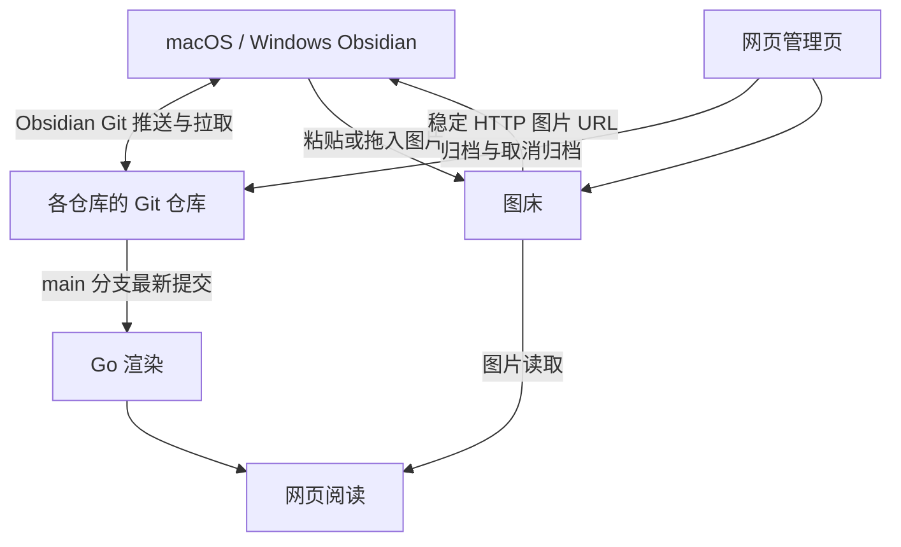

# ObsidianRepository 设计讨论稿

更新日期：2026-09-26

状态：已停止。2026-09-26 项目方向调整为不依赖 Obsidian 的网页知识库，现行方案见 [../DESIGN.md](../DESIGN.md)。本文仅保留为讨论记录，其中第 3 节的笔记库调查仍作为导入依据；其余内容（Git 同步、归档切换、配置中心、GitHub 改名计划等）不再执行。

本文件是项目方案的统一讨论入口。后续讨论直接修改对应章节，保持“已确认需求”“建议实现”“待讨论事项”的区别：第 2 节为已确认需求；第 4–11 节为建议实现，其中已确认的选型单独标注；第 12 节为待讨论事项。技术选型可以调整；不能把建议或验证计划写成已经实现的能力。

## 1. 项目定位与当前工作范围

建设一个供个人使用的 Obsidian 文档服务，包含多仓库 Git 同步、服务器图床、网页阅读，以及后续的集中配置管理。日常仍在 macOS、Windows 的 Obsidian 中写作，也可以在浏览器中阅读文章；暂时不写的仓库可以归档，只在网页上只读。

- 本地开发目录：`~/ali/ObsidianRepository`。
- 当前先维护本设计文档，以此持续讨论和修改，再开展开发。
- GitHub：现有 `Crashmere/ObsidianRepository` 保存的是笔记及图片备份。已确认将其改名为归档仓库，保持私有、内容不动，再新建同名仓库存放项目代码，见第 10 节。
- 当前没有下载完整资料备份、改名或新建 GitHub 仓库、部署服务或迁移笔记。前期检查获取了文件清单和正文等内容，不能将用于检查的稀疏检出视为完整备份。

项目代码与运行数据分别管理：代码仓库保存程序、CSS、部署配置模板、测试样本和文档；实际的笔记 Git 仓库、图片、元数据和备份保存在运行数据目录。

## 2. 已确认需求

| 方面 | 要求 |
| --- | --- |
| 客户端 | macOS 和 Windows 上的 Obsidian；日常基本只在一台电脑上写，两个系统都要能使用 |
| 首版范围 | 浏览器阅读站、Mac/Windows 正文同步、粘贴图片自动上传图床；网页配置中心放到后续版本 |
| 多仓库 | 笔记内容按仓库独立；可以共享插件、主题、CSS 和通用设置 |
| 仓库归档 | 在网页随时切换仓库是否归档：归档后只在网页只读，不再同步到本地；取消归档后同步到本地修改 |
| 显示效果 | 归档仓库在网页上、活跃仓库在本地 Obsidian 中，都要按其 CSS 等配置正确显示 |
| 配置管理 | 在网页中手动指定共享哪些配置、分别对哪些仓库生效；允许按系统或设备进一步区分（后续版本） |
| 正文同步 | 使用 Git：客户端用 Obsidian Git 插件，服务器上每个仓库对应一个 Git 仓库 |
| 阅读站渲染 | 在本项目的 Go 服务内渲染，不在 ali 上引入 Node |
| 服务器 | 使用现有 SSH 别名 `ali` 对应的服务器 |
| 访问方式 | 使用 HTTP，不配置 HTTPS、账号密码或登录系统，服务开放访问，写入接口也不加口令；设计上为以后改用 HTTPS 或域名保留空间 |
| 公开范围 | 全部笔记公开可读；含疑似密码写法的笔记由用户在迁移前自行检查 |
| 网页阅读 | 以单篇文章的样式展示为重点，支持目录导航和文章链接跳转 |
| Markdown 能力 | 代码高亮、数学公式、表格、图片、Callout、折叠块等已有语法 |
| Mermaid | 首版必须支持 Mermaid 代码块渲染，即使当前备份没有使用 |
| 双链 | `[[笔记名]]` 转换为可点击的网页链接；保留仓库内的正确链接关系 |
| 图片存储 | 所有文档图片持久化保存在服务器本地，服务器兼作文档库图床 |
| 图片引用 | 文档下载到本地后，图片引用指向服务器文件的 HTTP 地址 |
| 插件现状 | 用户目前没有安装社区插件，预计依赖较少 |
| 样式偏好 | 尽量通过 CSS 满足样式需求，不为样式引入复杂插件体系 |
| 后续扩展 | 可以以后安装插件；特殊插件的配置同步或渲染需求按需支持 |
| GitHub 仓库 | 旧仓库改名归档并保持私有，新建同名仓库存放项目代码 |
| 开发方式 | 接受必要的开发成本，先通过文档明确方案 |

开放访问是已确认的产品选择。2026-09-26 再次确认写入也保持开放，依靠服务端不可改写的 Git 历史和可恢复的删除来兜底，而不是访问控制。其含义是：访问者可以推送笔记、上传图片和切换仓库状态，仓库/设备标识仅用于分发与寻址，并不是身份凭据。HTTP 也不提供传输加密或防篡改能力。开放写入下必须遵守的工程边界见 9.2。

## 3. 当前文档库调查

调查基于 GitHub `main@388e3bd`，日期为 2026-09-26。采用文件清单、正文静态扫描与代表文章抽查；统计不是完整 Markdown 语法树分析，渲染效果仍需浏览器验证。

### 3.1 规模与结构

- 1,879 个文件，总文件内容约 342.09 MiB，不包含 Git 历史的额外占用。
- 314 篇 Markdown，正文合计约 3.25 MiB。
- 1,538 个图片文件：PNG 1,429 个、JPG 100 个、GIF 9 个。大小中位数约 92 KiB，90% 不超过约 341 KiB；73 张超过 1 MiB，其中 61 张超过 2 MiB，最大约 2.6 MiB。另有 21 张与其他图片内容完全相同，按内容去重后可共用对象。
- 文档主要分布于 AI记录、备份、开发手册、杂项、算法课和读书笔记。
- 找到 6 套 `.obsidian`：AI记录、备份/JUC、备份/实验记录、杂项、算法课、读书笔记。导入时应显式登记仓库边界，不能把所有顶层目录或整个 Git 仓库自动当成一个 Obsidian 仓库。
- 仓库中没有社区插件清单及插件程序目录；用户也已确认目前没有安装插件。

### 3.2 已用语法与渲染重点

| 内容 | 静态扫描结果 | 首版处理 |
| --- | --- | --- |
| 代码块 | 约 3,428 个，涉及 C++、Java、SQL、Shell 等 | 高亮、复制、横向滚动 |
| Callout | 726 个，其中 567 个带展开/折叠标记 | 标题、类型、默认折叠状态与交互 |
| 自定义代码 Callout | 313 个 `[!code]` | 适配现有 CSS |
| 数学公式 | 约 79 篇文章涉及 | 行内、多行、折叠块内公式 |
| 表格 | 约 177 处 | 宽表格横向滚动 |
| Markdown 图片 | 1,524 处引用 | 上传图床并规范化引用 |
| 其他图片语法 | Wiki 图片嵌入，以及 3 个带高度的 HTML 图片标签 | 转换链接并保留显示属性 |
| 外链图片 | 当前未发现 | 首版不做服务端抓取外链图片 |
| Wiki 笔记链接 | 11 处，目标均在仓库中 | 网页跳转及可选反向链接列表 |
| 高亮、任务列表、删除线 | 有使用 | 常规 Markdown 扩展支持 |
| YAML 属性 | 当前未发现 | 不依赖属性；需要按篇控制时再约定 |
| Mermaid | 当前未发现 | 按已确认需求加入首版 |
| Dataview、Canvas、Bases、Excalidraw | 当前未发现相应查询或文件 | 暂不纳入首版 |

算法课已有 `.obsidian/snippets/custom-callouts.css`，为 `[!code]` 提供深色背景、强调色边框、标题栏、语法配色与横向滚动。网页需适配其效果：渲染器输出与 Obsidian 相近的结构后，先验证该文件能否直接生效，再补网页专用覆盖（见 7.2），不能假定原样复制即可生效。

### 3.3 导入时需要处理的具体问题

1. 图片经常只写文件名，实际位于 `attachments` 等目录；必须先按原仓库的规则定位原文件，再生成图床链接。
2. `AI记录/Gradle 入门.md` 引用 `img-001.png`，而 `assets` 与 `attachments` 中存在两张内容不同的同名图片。导入时记录歧义并明确目标，不能随意选一张。
3. 最短路文章中有 3 个 ``。需要解析短路径并保留高度和并排展示。
4. `10. 令operator=返回一个reference to *this.md` 含 Windows 禁用的 `*`。迁移工作副本时规范文件名并检查引用，原始备份保留原样。
5. 部分代码语言标记为 `ini,`、`代码段` 等，需要规范别名或回退到纯文本，不能让单个代码块导致页面渲染失败。
6. `备份/CentOS/软件安装.md` 中存在未带协议的 `www.rpmfind.net` 链接，应识别为待修正外链。
7. 最大的一篇 Markdown 约 553 KiB，需验证长文目录、代码高亮和图片加载性能。

2026-09-26 按文件清单复核：Windows 不支持的文件名只有第 4 项这 1 个，没有仅大小写不同的路径，最长相对路径 77 个字符。另对正文做了只计数的粗扫：未发现私钥或 API Token，但少量笔记含疑似密码的写法（本文不列文件名）。用户已确认全部公开，这些笔记由用户在迁移前自行检查。

## 4. 建议架构

一个 Go 服务同时提供 Git 仓库托管、图床、网页渲染和管理页；客户端使用成熟的 Obsidian Git 插件同步正文，本项目只额外开发一个负责图片上传的轻量插件。



图中 B、D、F、H 由同一个 Go 服务提供。

### 4.1 组件与职责

| 组件 | 选型 | 说明 |
| --- | --- | --- |
| 正文同步（已确认） | 客户端 Obsidian Git 插件 | 启动时拉取、定时提交并推送；冲突以冲突标记保留 |
| Git 服务端 | 本服务通过 CGI 调用系统 `git http-backend` | 标准 Smart HTTP；推送规则由仓库配置和 pre-receive 检查执行 |
| 图片上传插件 | 本项目的轻量 Obsidian 插件 | 首版只负责粘贴/拖入上传、失败重试和引用替换 |
| 图床与元数据 | Go + SQLite 元数据 + 本地文件 | 按内容寻址；图片由 Nginx 直接读取文件返回 |
| 阅读站（已确认） | Go 服务内渲染：goldmark 及扩展 | 按需渲染并缓存，不需要 Node 和构建队列 |
| 管理页 | 同一服务内的轻量网页 | 仓库登记与归档切换、图片统计、渲染报告 |
| 配置中心 | 后续版本 | 通过向目标仓库提交配置文件分发，不另开同步通道，见第 8 节 |

客户端首版需要两个插件：Obsidian Git 负责同步，本项目插件负责图片上传；不因此引入额外的内容渲染插件。CSS 可以实现显示样式，但不能完成自动上传或同步。

选型记录：

- 未采用 Remotely Save + WebDAV：免费版遇到冲突只能选择保留较新或较大的一方，合并或保留副本属于付费功能；自动同步出错时静默失败；WebDAV 没有历史版本，开放写入下一次删除会同步到所有设备。
- 未采用 Quartz：需要 Node ≥ 22、npm ≥ 10.9.2（ali 上 npm 为 9.2.0），会把 Node 变成 ali 的运行依赖；无 swap 的主机上构建需要额外限制内存；单内容目录模型与按仓库解析链接不符；默认依赖外部 CDN，并原样输出笔记中的 HTML。
- 未采用 Syncthing：需要开放新的公网端口，并在 Obsidian 之外单独运行。

### 4.2 模块边界

- Git 负责笔记正文、明确纳入的非图片附件，以及每个仓库 `.obsidian` 中白名单内的配置（见 6.2）。
- 图床负责图片对象、稳定 URL、上传记录和引用关系；图片不进入 Git 仓库。
- 阅读站读取各仓库 `main` 分支的最新提交生成网页；网页阅读不直接修改笔记。
- 管理页修改仓库的归档状态；以后的配置中心通过向仓库提交文件分发配置。
- 同一个文件只由一个同步机制负责：正文和配置文件都只经 Git 传输，图片只经图床。
- 图床链接改写必须以普通提交进入仓库，不能在服务端背后修改文件却不留下提交。

## 5. 图片与服务器图床

### 5.1 图片的唯一持久来源

服务器本地保存全部文档图片，包括已有本地附件以及以后新增的图片。网页和客户端下载的文档都引用该图床。

原图保留，不默认有损压缩；GIF 保留动画。预览图或缩略图可以按需生成，但不能替代原图备份。

建议以图片内容的 SHA-256 作为 ID（可截取前 128 位以缩短链接），与仓库名、文章路径无关。这样相同内容天然共用一个对象，同名的不同图片天然得到不同 ID，备份校验也只需比对文件名与内容哈希。原文件名、格式、尺寸及来源映射记录在元数据中。

示意链接如下，主机名和路径均为占位示例，尚未部署：

```text
http://<服务器地址>/obsidianrepository/assets/<图片ID>.png
```

图床对象不可原位覆盖，替换图片产生新的 ID，避免缓存与历史版本互相污染。链接形式一旦写入上千处引用就难以更改，ID 长度与路径须在迁移前确定。

图片由 Nginx 直接读取文件返回，并设置一年的 `immutable` 缓存。同一 URL 的内容永不改变，Obsidian 和浏览器看过一次后即可使用本地缓存；在 ali 的带宽条件下这是必需的，见 9.4。

### 5.2 文档中的图片引用

正常同步及下载得到的 Markdown，使用指向服务器的绝对 HTTP 图片链接：

```markdown

```

转换时覆盖以下来源，并保留说明文字、尺寸和布局信息：

- Markdown 图片、引用式图片链接，以及 Obsidian 的 `` 尺寸写法。
- `![[图片名]]` 及带别名、尺寸的 Wiki 图片嵌入。
- `` 的 `src`、高度、宽度等受支持属性。
- 文档实际展示的外部 HTTP(S) 图片和内嵌图片数据（当前资料未发现外链图片）。
- 若主题或 CSS 引用了外部图片，也需纳入图片清单并转为本地服务资源。

普通的网页超链接不因为页面内含图片就自动抓取；只处理文档实际引用的图片资源。无法获取或存在歧义的图片应列入迁移报告，保留原文与原始备份，不能宣称已全部本地化。

阅读站输出 HTML 时，把笔记中指向本图床的绝对地址改写为 `/obsidianrepository/assets/...` 形式的根相对路径，使网页不受主机名或协议变化影响。不能把图片链接改回本机附件路径，也不能把图床内容打包进入项目源代码仓库。

### 5.3 新图片的上传流程

1. 用户在 Obsidian 粘贴或拖入图片，插件拦截默认的保存行为。
2. 插件立即在光标处插入带唯一 ID 的占位文本，并在后台上传图片。
3. 服务端校验类型和完整性，落盘成功后返回稳定 URL；同一内容重复上传返回同一对象，重试不会产生重复图片。
4. 插件按唯一 ID 找到占位文本并替换为服务器 URL。占位文本内容唯一，用户在上传期间继续编辑，也不会被旧的整篇内容覆盖。
5. 改写后的正文由 Obsidian Git 正常提交并推送。

上传失败或离线时，图片保存到被 Git 忽略的本地待上传目录，正文临时引用该本地文件，并记录待处理状态；恢复后自动重试，成功后按唯一文件名替换引用。不提前写入不存在的服务器 URL。插件另提供“上传当前笔记中的本地图片”命令，处理用户手动放入的图片。

待上传图片只存在于本机，其他设备和网页暂时看不到；阅读站对无法解析的本地图片引用显示明确提示，并在渲染报告中列出。

### 5.4 下载与离线行为

- 正常下载只获取 Markdown；其中的图片链接继续指向服务器，不要求下载整个图片目录。
- 本地打开文档时，图片由 Obsidian 经 HTTP 从服务器读取。首次打开图片多的笔记会明显慢于本地图片，见 9.4 的带宽实测。
- 离线时可以继续读写已下载正文，但未缓存过的图片不可见；客户端缓存不等于完整离线支持。
- 完整灾难恢复备份需包含 Git 仓库、全部图床原图和元数据。
- 如以后需要离线资料包，可增加独立导出模式，把图片附带下载并重写为相对路径；这是可选扩展，不改变正常下载使用服务器链接的要求。

### 5.5 图片迁移、删除与地址变化

- 先上传并验证图片，再改写文档，最后验证网页和客户端显示。
- 导入器输出“原引用 → 原文件 → 图片 ID → 新 URL”的映射清单，并提供可重复执行的行为。
- 文章删除不立即删除图片；同一图片可能被其他文章、历史提交或其他仓库引用。
- 图床清理需识别当前文档、Git 历史中仍引用的图片及保留期，避免破坏恢复能力。首版不自动执行不可恢复的图片清理。
- 当前资料没有外链图片，首版不提供服务端抓取外链图片的功能，也就不存在借此访问服务器内部服务的入口。
- 因文档使用绝对 URL，服务器地址、协议或前缀改变时，需要保留旧地址可达并执行受控链接迁移，见 9.5。

## 6. 多仓库正文同步（已确认使用 Git）

### 6.1 仓库模型

每个逻辑仓库在服务器上对应一个裸 Git 仓库，只使用 `main` 分支。仓库具有稳定 ID（用于 URL 和 Git 地址，建议使用简短英文）、显示名称和状态；同一仓库在不同设备上的本地路径可以不同，本地文件夹名也可以是中文。仓库标识不使用绝对文件路径，也不因显示名称变化而更换。

多个仓库的正文互不混合。初始导入依据用户实际使用方式建立仓库映射，尤其需要处理历史 `备份` 下的子仓库与普通目录。新仓库的历史从导入提交开始，旧的合并历史保留在 GitHub 归档仓库中。

### 6.2 仓库内容

| 内容 | 是否进入 Git |
| --- | --- |
| Markdown 笔记、明确纳入的非图片附件 | 是 |
| `.obsidian` 中的设置与外观：`app.json`、`appearance.json`、`core-plugins.json`、`community-plugins.json`、`hotkeys.json`、`snippets/`、`themes/` | 是，使仓库克隆到任何地方都按原样显示，网页也读取同一套 CSS |
| 网页专用的样式覆盖文件 | 是，放在 Obsidian 不读取的位置 |
| 图片 | 否，只经图床 |
| 社区插件程序与插件数据（`.obsidian/plugins/`） | 否，见 9.2 |
| 工作区布局、缓存、待上传图片目录 | 否 |

`.gitignore` 帮助客户端不提交被排除的内容；服务端推送检查按同一白名单强制执行。仓库加入 `.gitattributes` 关闭换行符转换，使 Mac 和 Windows 上的文件内容完全一致。

### 6.3 同步行为

- 客户端启动时拉取，编辑后定时提交并推送（间隔待定）；推送前先拉取合并。
- 服务端拒绝非快进推送和删除分支，任何提交都不能被覆盖或抹去；误删、误改可以从历史恢复。
- 两台设备修改同一篇笔记时，Git 无法自动合并的部分以冲突标记保留在笔记中，由用户处理；不把“最后上传覆盖”当作可靠合并。用户日常基本只在一台电脑上写，预计很少出现。
- 支持新增、修改、删除和重命名；对断网重连、重复推送、中文及带空格路径进行验证。
- 推送检查拦截 Windows 不支持的文件名和仅大小写不同的路径，避免一端能创建、另一端无法检出。首次导入对已有的此类文件制定明确映射并同步修正链接。
- 同步结果以 Obsidian Git 在客户端显示的状态为准；管理页显示每个仓库最后一次推送的时间和提交，便于发现长期没有同步的情况。

HTTP 桌面端连接需用实际 Obsidian 和 Obsidian Git 在 Mac、Windows 上验证；当前没有完成设备间同步测试。首版不以手机端支持、实时多人协同或自研同步协议为目标。

### 6.4 归档与取消归档

仓库有“活跃”和“归档”两种状态，在管理页随时切换。

- 活跃：接受推送，本地通过 Obsidian Git 同步修改，网页同时展示最新提交。
- 归档：服务端拒绝推送并返回明确提示，网页继续展示并标注“已归档”。本地副本不再需要，是否删除由用户决定。
- 归档前，管理页显示最后推送时间，提醒先确认本地修改已全部推送；服务端看不到本地未推送的内容。归档后若本地仍有新提交，推送会失败并提示，不会丢失，取消归档后即可推送。
- 系统不自动删除本地副本。本地删除不可逆，只提供检查有无未推送修改的方法和删除指引。
- 取消归档：服务端重新接受推送，管理页给出本地检出步骤（见 6.5）。
- 显示配置随仓库保存：归档仓库在网页按仓库内的 CSS 显示；取消归档后克隆到本地，Obsidian 也得到同一套配置。

建议初始导入时所有仓库默认为归档，用户需要写哪个再取消归档。

### 6.5 本地检出

取消归档或在新电脑上使用某个仓库时：

1. 用 Git 把仓库克隆到本地任意文件夹，用 Obsidian 打开。
2. 安装 Obsidian Git 和本项目上传插件，填写服务器地址。
3. 确认同步正常后开始写作。

插件程序只从 Obsidian 官方市场或项目 GitHub 发布页等 HTTPS 来源安装，不从本服务的开放接口下载（见 9.2）。首版按管理页上的步骤手动操作，之后可提供一个本地脚本一次完成克隆、插件安装和设置。

## 7. 网页阅读与 CSS

### 7.1 首版阅读能力

- 仓库列表（标注活跃或归档）、目录树、文章目录和搜索。
- 正文 Markdown、图片、表格、数学公式、代码高亮与横向滚动。
- Callout 类型、标题、嵌套内容以及默认展开/折叠状态。
- 自定义 `[!code]` 的现有视觉效果。
- Mermaid 代码块渲染，至少验证流程图与时序图。
- Wiki 双链及普通文章链接跳转；目标不存在时有清晰提示。
- 根据已解析链接生成文章的反向引用列表，关系图不作为重点。
- 按 Git 历史显示文章的更新时间。

### 7.2 Go 渲染与样式适配（已确认使用 Go 渲染）

以 goldmark 为基础，使用成熟扩展处理 GFM 表格、任务列表、脚注、Wiki 链接、Mermaid 和目录，代码高亮在服务端完成；自行实现 Callout 折叠、`==高亮==`、Obsidian 图片尺寸写法和按仓库解析链接。重点适配现有文章，而不是承诺所有 Obsidian 或社区插件能力都完全一致。

- 输出的 HTML 结构和类名尽量与 Obsidian 一致（例如 Callout 使用 `.callout[data-callout="code"]`、`.callout-title`、`.callout-content`），并定义常用的 Obsidian CSS 变量，使仓库内启用的 CSS snippets 可以直接用于网页，只对差异部分写网页专用覆盖。
- 网页按仓库加载该仓库启用的 snippets 与网页覆盖文件，归档仓库同样按此显示。
- 在网页上验证 `custom-callouts.css` 的颜色、标题、边框、间距和滚动效果，处理代码高亮配色与 Obsidian CSS 变量的差异，不能只复制 CSS 文件就结束验收。
- 数学公式优先验证 MathJax（与 Obsidian 使用的引擎一致），重点使用折叠块中的多行公式作为样本；只在含公式的页面加载。
- Mermaid 固定版本，由浏览器渲染，只在含 Mermaid 的页面加载；Obsidian 自带的 Mermaid 版本不同，个别图形可能有差异。外部图片引用仍遵守图床规则。
- 未知或写错的代码语言回退为纯文本，单个代码块不能导致页面渲染失败。
- 搜索在服务端进行：全部正文约 3.25 MiB，可直接在内存中做子串匹配，中文无需分词，也不必把全文索引下载到浏览器。
- HTTP 页面上浏览器不提供剪贴板 API，代码复制按钮需使用降级方式；不能仅在 localhost 测试后认为公网 HTTP 行为相同。
- 脚本、样式和公式字体随站点部署，不依赖外部 CDN；中文使用系统字体，不下发中文网页字体。

Obsidian 客户端和网页的 DOM 不可能完全相同，同一段 CSS 不能保证两端原样通用；上述做法是尽量减少需要单独适配的部分。

### 7.3 链接与渲染规则

- 普通笔记链接默认在所属仓库范围内解析，遵循该仓库在 Obsidian 中设置的链接格式。
- 文件名短链接、中文、空格、标题锚点均需转换为有效网页 URL。
- 同名目标不静默挑选；渲染报告输出歧义与断链。
- 当前不扩展自定义跨仓库 Wiki 语法，跨仓库跳转可先使用明确网页链接。
- 网页始终展示各仓库 `main` 分支的最新提交：按需渲染并按提交缓存，新提交到达后失效。不需要构建队列，也不存在新版本只生成一半的状态。
- 单篇文章渲染失败只影响该篇，页面显示原因，其余文章正常访问。
- 图片使用图床 URL 和懒加载，长文测试滚动、目录和高亮性能。

## 8. 网页配置中心（后续版本）

用户确认首版不做配置中心。首版中各仓库的显示配置随仓库保存在 Git 中（见 6.2），本地和网页都能正确显示；配置中心解决的是跨仓库共享与统一修改。

### 8.1 管理对象

配置中心以设置项和资源为单位，而不是只支持覆盖整个 `.obsidian` 目录。

| 对象 | 边界 |
| --- | --- |
| 通用设置 | 编辑器偏好、拼写检查、栏宽等支持选择具体字段 |
| CSS snippets | 上传/编辑、启用状态、版本与目标仓库 |
| 主题与外观 | 主题相关资源和通用外观设置；两端样式差异明确标注 |
| 快捷键 | 支持共享；必要时按 macOS、Windows 覆盖 |
| 仓库路径设置 | 附件目录、模板目录等默认保持各仓库自己的值，可明确选入托管 |
| 工作区状态 | 标签页、窗口布局、最近文件等不共享 |
| 插件 | 可共享插件清单与非敏感设置；插件程序不经本服务分发（见 9.2）；不做任意插件自动安装、特殊配置合并或专属表单 |
| 缓存及凭据 | 不纳入共享设置；插件自身的服务器地址等本地设置不全局覆盖 |

以后安装插件时，可先增加通用配置文件/JSON 字段管理；有实际需求再处理特殊插件。任意 Obsidian 插件没有统一的配置表单描述，不承诺自动复制所有插件的原生设置界面。

### 8.2 网页操作流程

1. 查看仓库以及各客户端最后拉取到的提交与配置状态。
2. 从某个仓库导入候选设置，或手动创建配置。
3. 选择托管字段、CSS 或主题资源。
4. 指定目标仓库、仓库分组，必要时限定操作系统。
5. 预览最终值、配置来源、覆盖关系以及将改变的内容。
6. 发布配置版本，查看各端应用结果；需要时回滚到保留版本。

示例规则：

| 规则 | 目标 | 内容 |
| --- | --- | --- |
| 全局默认 | 所有仓库 | 关闭拼写检查，统一通用编辑器设置 |
| 算法阅读样式 | 算法课 | 启用自定义代码 Callout CSS |
| 宽幅阅读 | AI记录、实验记录 | 关闭缩减栏宽 |
| Windows 快捷键 | 指定仓库的 Windows 客户端 | 覆盖少量快捷键 |

### 8.3 覆盖、发布与客户端应用

建议方向：配置中心不另开同步通道，而是把计算出的最终配置作为普通提交写入各目标仓库的 `.obsidian`，客户端经 Obsidian Git 拉取。正文和配置只有一个传输机制，历史、回滚和冲突处理都沿用 Git。

- 优先级由低到高为：全局默认、仓库分组、具体仓库、操作系统规则。同一级规则冲突时要求明确优先级，不能靠提交先后或不透明的“最后写入”决定。
- 用户日常基本只用一台电脑，按操作系统或设备区分的规则优先级较低；需要时可利用 Obsidian 按设备覆盖配置文件夹的能力。
- 网页发布的配置版本是已托管项的权威来源；客户端推送的对托管文件的修改作为待发布候选显示，不自动传播到其他仓库。
- 未托管项继续由各仓库自己维护；暂未登记的仓库不会被隐式覆盖。
- 客户端拉取到新配置后，插件提示重新加载 Obsidian，不在用户写作时强制重启。
- 调整托管范围时必须明确退出托管后的值，不能自动清空设置。

需要验证的风险：Obsidian 运行时把设置保存在内存中，并会回写 `.obsidian` 下的文件，外部写入可能被覆盖或需要重启才生效；不重启即生效只能依赖未公开的内部接口，Obsidian 升级时可能失效。须确认“拉取后重新加载”能稳定生效，并且不会因 Obsidian 回写而把旧配置重新推送回服务器。

规则中的设备名和仓库 ID 仅表达适用范围，不提供鉴权隔离。

## 9. 部署、数据与备份

### 9.1 ali 部署方向

沿用共享 `server-operations` 约定：Nginx HTTP 路径入口、应用独立运行身份、内部服务监听 loopback、systemd 管理，程序在本机构建为单个 Go 可执行文件。实际部署前重新核对共享应用清单和端口，登记新应用并验证已有应用。

新增的运行依赖是系统 `git`（Ubuntu 官方包，ali 上已安装，但目前不是任何应用的运行依赖），部署时写入共享清单。渲染在服务内按需进行，为服务设置内存和 CPU 上限。

建议 URL 前缀为 `/obsidianrepository/`，属于待验证的路径选择；当前没有配置此入口，也没有分配端口。示意分区：

```text
/obsidianrepository/             阅读站
/obsidianrepository/manage/      管理页
/obsidianrepository/assets/      图片读取（Nginx 直接返回文件）
/obsidianrepository/api/         应用接口（图片上传等）
/obsidianrepository/git/         Git Smart HTTP
```

应用自己的 Nginx location 需要注意：图片上传和 Git 推送要单独设置 `client_max_body_size`（Nginx 默认只有 1 MB）；为 CSS、JS、JSON 开启 gzip（ali 的 `nginx.conf` 目前只压缩 HTML）；图片路径返回长期缓存头。请求限流在应用内实现，避免修改共享 Nginx 的 http 级配置。

建议服务器数据结构：

```text
/opt/obsidianrepository/
  config/                       运行与部署配置
  data/
    repos/<vault-id>.git        各仓库的裸 Git 仓库
    assets/                     图床原图
    metadata/                   SQLite：仓库登记、图片映射、状态
  backups/                      一致性备份
  releases/                     程序发布结果
  docs/                         已发布项目文档副本
```

此结构是设计提案，不是现场目录清单。运行数据不随代码发布覆盖。

### 9.2 开放服务下的工程边界

保持用户选择的 HTTP、无账号方式，同时限制程序操作范围，并保证破坏可以恢复：

- Git 仓库配置 `receive.denyNonFastForwards` 与 `receive.denyDeletes`，只接受对 `main` 的快进推送；`receive.maxInputSize` 限制单次推送大小，并设置仓库容量上限。匿名推送需显式开启 `http.receivepack`。
- pre-receive 检查由发布的程序提供（通过 `core.hooksPath` 指向 root 管理的目录），拒绝：`.obsidian/plugins/` 下的任何内容、白名单外的 `.obsidian` 文件、`.gitmodules`、符号链接、图片文件、超过大小上限的文件、Windows 不支持的文件名，以及对归档仓库的推送。
- 插件程序和插件数据不经任何开放接口或 Git 仓库分发。插件是能访问 Node.js 的任意代码，插件数据中也可能含有可执行文件路径等设置；开放写入下，这些内容一旦经同步到达客户端，等于任何人都能在用户电脑上执行代码。
- 以后若安装会执行笔记内容的插件（例如开启 JavaScript 查询的 Dataview、Templater 的用户脚本），任何人推送的笔记都能在用户电脑上执行代码。安装这类插件之前，必须先为写入加上保护。
- 应用只能访问自身数据目录，文件路径校验阻止目录穿越。
- 图床上传按文件内容校验类型，限制单个文件大小，设置总配额与请求频率。
- 笔记里的 HTML 按白名单净化，Mermaid 及图片按受支持方式渲染，不执行任意脚本、插件程序或命令；阅读站设置内容安全策略，只允许加载本站脚本。
- 用户笔记、CSS、图片均不能作为服务端程序代码加载；SVG 等格式需明确安全展示方式。
- 同 IP 不同路径属于浏览器同源，内容渲染和附件响应需防止影响 ali 上的其他应用。
- 备份及历史恢复材料不放在公开图床或 Git 服务可访问的目录。

这些措施减少程序越界和误操作，并保证可以恢复，但不消除匿名写入、仓库状态被他人切换、图床被滥用或明文传输带来的风险。ali 的访问日志中已出现 WebDAV 探测等扫描请求（见 9.4），开放接口会被自动化程序发现。

### 9.3 备份与恢复

备份必须覆盖 Git 仓库、图床原图、元数据与图片映射，保证恢复后文档链接仍能找到相应图片。

- SQLite 使用一致性备份方式；Git 仓库以一致的方式复制或打包；图片为不可变对象，按“文件名即内容哈希”校验完整性。
- 迁移后图片只在服务器上有完整副本，客户端只下载 Markdown。异机备份列为首版验收条件：建议由 Mac 定时从服务器拉取备份，图片可增量同步；具体方式待定。
- 活跃仓库的本地克隆包含完整 Git 历史，是正文的额外副本，但不包含图片。
- 保留周期与调度在实施前确定，并写入运维文档；通过 unit 实际运行一次备份，并在隔离目录验证恢复。

同步不是备份。旧 GitHub 资料保留在归档仓库中，迁移验收期间另存一份经过校验的本地完整备份。

### 9.4 容量与带宽（2026-09-26 实测）

- 主机：2 vCPU，约 1.7 GiB 内存，可用约 1.2 GiB，无 swap；根盘剩余约 32 GiB。
- 带宽：从开发用的 Mac 经 SSH 实测，服务器到客户端约 0.5 MB/s（约 4 Mbps），客户端到服务器约 1 MB/s，出方向明显受限；公网带宽配置待在阿里云控制台确认。
- 影响：按 0.5 MB/s 计，中位数大小的图片约 0.2 秒，2 MiB 以上的图片每张 4–5 秒；首次打开图片多的笔记会有明显等待，并会占满带宽、拖慢同机其他应用。
- 对策：图片长期缓存并由 Nginx 直接返回；文本资源压缩；公式和 Mermaid 脚本只在需要的页面加载。网页展示用的 WebP 或限宽图可以以后按需增加；是否把公网带宽改为按流量计费（约 0.8 元/GB，以控制台为准）由用户决定。
- 扫描：2026-09-16 至 09-26 的 Nginx 访问日志中，约三分之一的请求不属于任何应用路径，其中有 6 次 WebDAV `PROPFIND` 探测。

### 9.5 为 HTTPS 或域名保留的扩展空间

当前不启用 HTTPS，但设计上不堵死以后改用 HTTPS 或域名的可能：

- 服务端只保存图片 ID，对外基础地址是单一配置项，所有生成的绝对地址都由它拼出。
- 网页中的图片、脚本、样式和链接一律使用根相对路径，协议或主机变化不影响网页。
- 图片路径只依赖内容 ID，与主机无关。以后更换协议或主机时，由工具在各仓库生成一次替换基础地址的提交，可审查、可回退；过渡期保留旧的 HTTP 地址可访问。
- 客户端的 Git 远程地址和插件服务器地址各是一个设置项，更换时逐台修改。
- 可选路径：Let's Encrypt 自 2026 年 1 月起签发纯 IP 地址的证书（有效期约 6 天，必须自动续期），不需要域名。启用会涉及共享 Nginx 和所有应用，按共享约定先确认。

## 10. GitHub 仓库用途迁移（已确认改名方案）

现有 `Crashmere/ObsidianRepository` 改名为归档仓库（例如 `ObsidianNotesArchive`），保持私有、内容与历史不动；再新建同名的 `Crashmere/ObsidianRepository` 存放项目代码。这样代码仓库没有笔记历史，以后即使公开也不会泄露笔记；归档仓库本身也是一份完整备份。当前仅记录计划，按以下顺序实施：

1. 完整下载原仓库中的笔记、图片、配置及历史，在 `~/ali/ObsidianRepository` 之外保存并记录校验清单，确认文件数、大小及内容完整；若实际存在 LFS 或其他外置对象，一并验证获取完整。用于调查的临时目录不替代此备份。
2. 找出每台电脑上指向 `Crashmere/ObsidianRepository` 的本地克隆，先把它们的远程地址改为归档仓库的新名字。GitHub 在仓库改名后会把旧名字重定向到新名字，但同名新仓库一旦创建，重定向即失效，旧克隆的推送会发往新的代码仓库。
3. 在 GitHub 上改名，更新描述，保持私有。
4. 立即新建同名代码仓库并推送首个提交，使意外推送因历史不相关而被拒绝。可见性另行决定；若公开，遵守共享约定，不写入服务器公网地址与无鉴权路径的组合。
5. 后续从归档仓库生成迁移工作副本，建立仓库映射，处理 Windows 文件名和歧义引用。
6. 服务就绪后上传图片、改写工作副本中的文档链接，为每个仓库生成导入提交，并完成代表样本及完整链接检查。
7. 项目 GitHub 仓库负责代码和文档，笔记与图片按第 9 节的备份策略维护。

开发目录不作为原始资料的唯一备份位置。实际操作时以已经验证的备份和当时的仓库状态为准。

## 11. 实施阶段与验收

### 阶段 A：设计讨论

- 维护本文，明确 Git 同步、图床上传、归档和显示配置的职责。
- 明确初始仓库划分、图片链接形式和首版页面。
- 当前处于此阶段。

### 阶段 B：代表样本原型

- 从旧资料快照导入两个仓库到测试环境：图床、导入器、Go 渲染和只读阅读站。
- 使用 `题目描述.md`、树形 DP、最短路、《Effective C++》双链、长文章作为代表样本；另加 Mermaid 流程图和时序图样本，因为原备份没有对应内容。
- 对比 Obsidian 与网页中的折叠块、公式、代码和样式，验证仓库 snippets 直接用于网页的效果；以浏览器实际结果验收。
- 在 Mac 和 Windows 的当前 Obsidian 版本上验证：HTTP 图片能显示；Obsidian Git 经 HTTP 推送和拉取；中文路径与重命名；`.obsidian` 白名单文件是否因 Obsidian 自动改写而产生无意义提交。
- 验证粘贴上传、占位替换、上传中继续编辑、HTML 图片尺寸，以及下载后从服务器读取图片；测量真实带宽下的加载时间与缓存效果。

### 阶段 C：可用首版

- 在 ali 部署 Git 托管、图床、阅读站、管理页和归档切换。
- 验证修改、删除、重命名、离线重连和冲突标记；验证归档后拒绝推送、取消归档后检出。
- 验证上传失败重试、重复图片、同名不同图。
- 完成开放写入下的防护验证、资源限制、备份（含异机）与隔离恢复验证。

### 阶段 D：资料迁移与上线

- 完成 GitHub 改名归档（可在原始资料完整备份后提前进行），迁移图片与正文，核对所有资源引用。
- 处理已发现的 Windows 文件名、图片歧义和外链问题。
- 完成部署记录与共享服务器文档更新。

### 阶段 E：配置中心（后续）

- 按第 8 节实现跨仓库配置共享，先从 CSS snippets 开始。

首版的关键验收条件：

1. 两个桌面系统可以同步同一仓库，多个仓库正文互不混合；强制推送和删除分支被拒绝。
2. 归档仓库拒绝推送且网页可读；取消归档后克隆到本地，显示配置与网页一致。
3. Mermaid、公式、自定义代码 Callout、表格和双链在浏览器中可用，仓库 CSS 在网页生效。
4. 完成迁移的文档图片全部由服务器本地文件提供，下载后的正常文档仍引用服务器 URL，长期缓存生效。
5. 图片上传失败不会破坏本地原图或正文，链接歧义不会被静默忽略。
6. 推送检查能拦截插件目录、白名单外文件和 Windows 不支持的文件名；上传限制生效。
7. 旧资料完整备份、Git 仓库与图床的异机备份和恢复路径均有证据。
8. 新服务不改变其他 ali 应用的访问与运行行为。

## 12. 待继续讨论的选择

以下事项不阻碍当前维护文档，后续逐项收敛：

- 初始仓库的精确范围，特别是 `备份` 下的子仓库、其他资料与 `开发手册` 的登记方式；导入后是否全部默认归档。
- 图片 ID 的长度与 URL 形式（迁移前必须确定）。
- 非图片附件（PDF 等）走 Git 还是图床，以及大小上限。
- 导入器在本地还是在服务器上运行。
- 异机备份的具体方式：Mac 定时拉取或对象存储。
- Obsidian Git 的自动提交与推送间隔，可接受的网页更新延迟。
- 本地检出用手动步骤还是提供脚本；项目代码仓库是否公开。
- 是否把公网带宽改为按流量计费，是否为网页生成展示用缩略图。
- 管理页的最小范围、备份保留策略。

手机端、完整离线图片包、特殊插件兼容、网页编辑笔记、复杂图谱和实时多人协同均保留为后续按需扩展，不因架构留有入口而自动列入首版。

## 13. 参考来源

- [当前资料仓库](https://github.com/Crashmere/ObsidianRepository)，调查快照 `388e3bd`；改名后以归档仓库的新地址为准。
- [Obsidian Git](https://github.com/Vinzent03/obsidian-git)。
- [git http-backend](https://git-scm.com/docs/git-http-backend) 与 [git config 中的 receive 选项](https://git-scm.com/docs/git-config)。
- [goldmark](https://github.com/yuin/goldmark)。
- [Remotely Save](https://github.com/remotely-save/remotely-save)（未采用原因见 4.1）。
- [Quartz Obsidian 兼容说明](https://quartz.jzhao.xyz/features/obsidian-compatibility)（未采用原因见 4.1）。
- [Let's Encrypt：6 天与 IP 地址证书正式可用](https://letsencrypt.org/2026/01/15/6day-and-ip-general-availability.html)。
- [服务器维护约定的来源](https://github.com/Crashmere/agent-config/tree/main/skills/server-operations)。

外部项目的能力与接口可能变化，实施时固定版本并用实际文档验证。服务器实况以部署时的现场检查为准，本文不替代共享服务器清单或项目运维记录。
